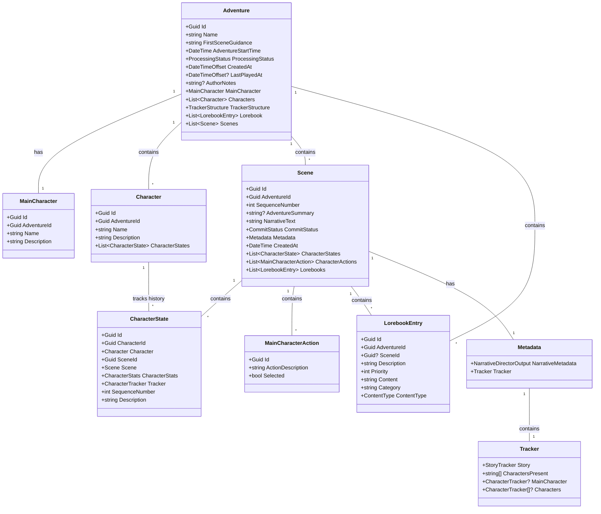

# Data Model (Infrastructure, Persistence, Entities)

The data model is built using Entity Framework Core entities. The root of the hierarchy is the `Adventure`, which contains multiple `Scenes`, `Characters`, and other related data.

### Entities Class Diagram

