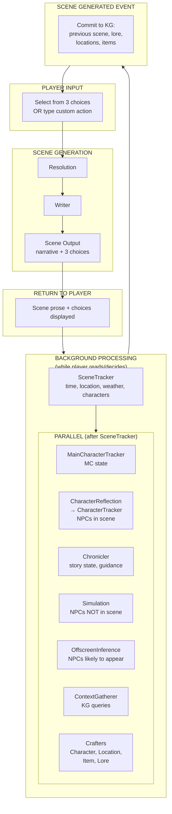
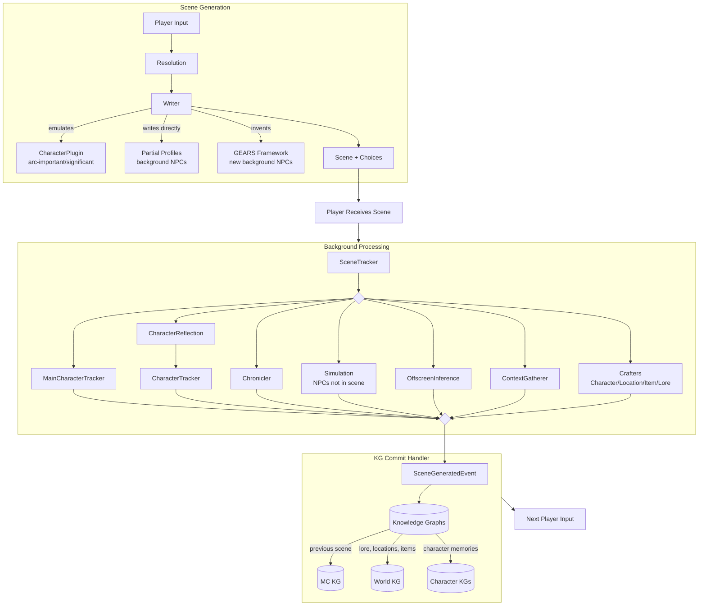

# FableCraft System Overview

FableCraft is a standalone interactive fiction engine that produces NPCs with genuine agency. Characters act rather than react. Antagonists scheme without waiting for player input. Love interests seek the protagonist. The world moves.

## The Problem FableCraft Solves

Single-model interactive fiction systems (e.g., SillyTavern) have one model juggling everything. This leads to:

- Knowledge bleed between characters (the bartender somehow knows what the villain said in private)
- Memory inconsistency (characters forget important events, remember things they shouldn't)
- Reactive NPCs (everyone waits for the player to act first)
- Forced hooks (plot points feel contrived rather than emergent)

FableCraft's approach:

- Strong knowledge boundaries (separate knowledge graph per important character)
- Character emulation at write-time (full psychological context when characters act)
- Off-screen simulation (characters live between encounters)
- Narrative awareness (story fabric tracking, world momentum, writer guidance)

---

## Setup Phase

Before gameplay begins, the player/creator provides:

| Input | Description |
|-------|-------------|
| **Story Bible** | Authored upfront. Defines tone, content calibration, genre conventions, narrative rules. |
| **Worldbook** | Lore, factions, locations, history. Committed to the World Knowledge Graph. |
| **Tracker Schema** | Defines what gets tracked for characters (stats, resources, skills, physical state). |
| **Main Character** | Name and description only. The system initializes full tracker state via InitMainCharacterTrackerAgent. |
| **First Scene Instructions** | Guidance for generating the opening scene. |

Once provided, the system:

1. Commits the worldbook to the World Knowledge Graph
2. Initializes the Main Character tracker state
3. Generates the first scene
4. Returns the scene with three choices to the player

---

## Core Gameplay Loop

Each player input triggers one full cycle. The scene boundary is the player action.

---

## Scene Generation Pipeline

### Step 1: Resolution

The Resolution Agent determines what physically happens when the player attempts an action. It functions as a physics engine—fast, impartial, mechanical.

**Action Types:**

| Type | Definition | What Resolution Determines |
|------|------------|---------------------------|
| PHYSICAL | Against environment only | Full outcome |
| FORCE_CONTESTED | Imposing on NPC through force | Whether force lands (hit/miss, damage). NOT behavioral response. |
| SOCIAL_CONTESTED | Attempting to change NPC's mind | Execution quality only. Outcome emerges from NPC emulation. |

### Step 2: Writer

The Writer transforms resolved actions into immersive first-person present-tense narrative. Core rules:

- **First person present tense** — "I see the blade swing toward me" not "I saw"
- **Continuity is absolute** — Every scene continues directly from the previous one
- **Player agency protected** — Writer describes, player decides
- **Knowledge boundaries real** — MC only knows what MC knows
- **Characters autonomous** — NPCs have goals, emotions, agency
- **Scene moves** — Everyone acts simultaneously; the world doesn't pause for MC

**Character Handling During Scene:**

| Tier | How Writer Handles Them |
|------|------------------------|
| Arc-important | Calls CharacterPlugin for emulation (full psychological context) |
| Significant | Calls CharacterPlugin for emulation |
| Background | Writes directly using partial profile |
| New background | Uses GEARS framework (Goal, Emotion, Attention, Reaction, Self-interest) |

### Step 3: Output

The Writer produces:

- **Scene prose** — 3-5 paragraphs, first-person present-tense
- **Three choices** — Meaningfully different approaches, phrased in first person
- **Creation requests** — Characters, locations, or items that need full profiles
- **Importance flags** — Requests to promote/demote character tiers

---

## Background Processing

All background processing runs while the player reads the scene and decides their next action.

### Phase 1: SceneTracker (runs first)
Updates mechanical scene state. Other agents depend on this output.
- DateTime
- Location
- Weather
- CharactersPresent

### Phase 2: Parallel Processing

Everything else runs in parallel after SceneTracker completes:

#### MainCharacterTracker (MC only)
Updates the protagonist's physical state:
- Vitals, needs, resources
- Equipment changes
- Skill progression
- Physical condition

#### CharacterReflection → CharacterTracker (NPCs in scene, sequential chain)
Runs for each meaningful NPC present in the scene.

**CharacterReflection** transforms the MC-POV scene into the character's subjective memory:
- Scene rewrite (their perspective, their biases, their knowledge boundaries)
- Memory index entry (summary, salience, emotional tone, tags)
- Relationship updates
- State changes

**CharacterTracker** runs immediately after, updating the NPC's physical state. Separated due to complexity, but logically one flow.

#### Chronicler
Tracks narrative fabric and world momentum:

**MC's Story:**
- Dramatic questions ("Will she escape?")
- Promises (Chekhov's guns, setups)
- Active threads (plotlines in motion)
- Stakes (what's at risk, deadlines)
- Windows (time-limited opportunities)

**World's Story:**
- World momentum (events progressing independently of MC)

**Outputs:**
- `writer_guidance` — Narrative direction for next scene
- `story_state` — Complete narrative fabric (persisted)
- `world_events` — Events to emit to World KG

#### Simulation Pipeline
Runs when arc-important characters are stale (>6 in-world hours since last simulation) or likely to appear.

**Critical:** Simulation does NOT run for characters present in the current scene. Those characters are updated by CharacterReflection instead.

**All-or-Nothing Rule:** If any arc-important character simulates, ALL arc-important characters simulate (except those in scene). This prevents temporal paradoxes.

**Outputs:**
- Character scenes and memories
- State updates
- `pending_mc_interactions` — NPCs who decided to seek the protagonist
- `world_events_emitted` — Facts others could discover

#### OffscreenInference
For significant characters likely to appear in the next scene. Lightweight simulation that produces brief memories so they know what they've been doing.

#### ContextGatherer
Queries Knowledge Graphs for:
- World context (lore, locations, factions)
- Character memories (for NPCs likely in next scene)
- Relationship data
- Narrative history

#### Crafters
Generate full profiles when the Writer requests them via `creation_requests`:
- **CharacterCrafter** — Full character profiles for new important/significant NPCs
- **LocationCrafter** — Location details with sensory information, territorial control, navigation
- **ItemCrafter** — Item properties, history, mechanical effects
- **LoreCrafter** — World lore with temporal context, reliability, faction perspectives

---

## SceneGeneratedEvent Handler

After all background processing completes, the system emits a `SceneGeneratedEvent`. A handler catches this and commits to the Knowledge Graph:

- The **previous** scene narrative (to MC KG)
- Any generated lore (to World KG)
- Any generated locations (to World KG)
- Any generated items (to World KG)

**Why the previous scene, not the current one?** The current scene can be regenerated or modified by the user if the AI makes a mistake. Only when the player submits their next input is the previous scene considered "final" and safe to commit. This prevents polluting the KG with discarded regenerations.

---

## Character Tiers

Hard cap: ~8 arc-important characters maximum. This is a narrative principle—stories have limited bandwidth for characters with agency.

| Tier | Count | Agency | Profile | Own KG | Off-Screen Processing |
|------|-------|--------|---------|--------|----------------------|
| **Arc-important** | 4-8 | Active (drives story) | Full | Yes | Full simulation |
| **Significant** | 10-20 | Passive (consistent when encountered) | Full | Yes | Offscreen inference |
| **Background** | Unlimited | None (functional roles) | Partial | No | Nothing |

Arc-important and significant have identical data structures. The only difference is off-screen processing. Promotion/demotion is just a flag flip.

**Promote when:**
- Character's independent decisions start affecting the story
- Character develops goals involving the MC
- Writer flags upgrade request

**Demote when:**
- Character's arc resolves
- Character exits active story area long-term
- Need room for newly important character

---

## Knowledge Architecture

Three separate knowledge graphs enforce strict knowledge boundaries:

### World KG (Shared)
- Lore, locations, factions, history
- World events (things that happened publicly)
- Facts anyone could discover
- Fed by: LoreCrafter, LocationCrafter, Chronicler, simulation `world_events_emitted`

### MC KG (Protagonist)
- Narrative from MC's point of view
- MC's memories and experiences
- What MC knows and has witnessed
- Fed by: Scene generation

### Character KGs (Per Character)
- Narrative from that character's POV
- Scene rewrites (their subjective experience)
- Simulation narratives (off-screen experiences)
- What they know, witnessed, concluded
- Fed by: CharacterReflection, Simulation, OffscreenInference

### Boundary Rules

**Characters cannot access:**
- MC KG (they don't know MC's thoughts)
- Other characters' KGs (they don't know others' private experiences)

**Characters CAN access:**
- World KG (public/discoverable facts)
- Their own KG (their memories)

---

## Data Flow Summary

---

## Key Design Decisions

**Why separate KGs per character?**
Knowledge boundaries. Each character's memories are their own. No bleed from a single model "knowing" what everyone experienced.

**Why simulation threshold instead of every scene?**
Efficiency. Rapid scene sequences (combat, conversations) don't need NPC catch-up. Simulation runs when meaningful time passes.

**Why hard cap on arc-important?**
Narrative discipline + compute budget. More than 8 characters with full simulation becomes unwieldy for both the story and the system.

**Why Chronicler separate from SceneTracker?**
Different concerns. SceneTracker is mechanical (where, when, who). Chronicler is artistic (narrative fabric, promises, momentum).

**Why prose-based relationships instead of numerical scores?**
LLMs reason more naturally in prose. "Trust: 35" means nothing to a model—it's an arbitrary number. "I trusted him until he sold out my brother" is actionable.

**Why first-person present tense?**
Immersion. The player IS the character experiencing the moment, not reading about someone else's past.

**Why commit the previous scene instead of the current one?**
Error recovery. The current scene can be regenerated if the AI makes mistakes. Only when the player moves forward is the previous scene "finalized" and committed to the KG. This keeps the knowledge graph clean of discarded content.