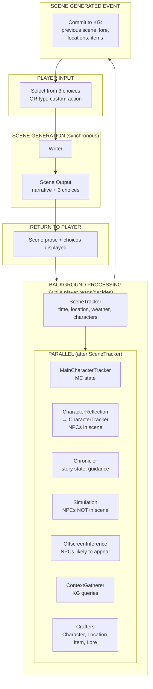
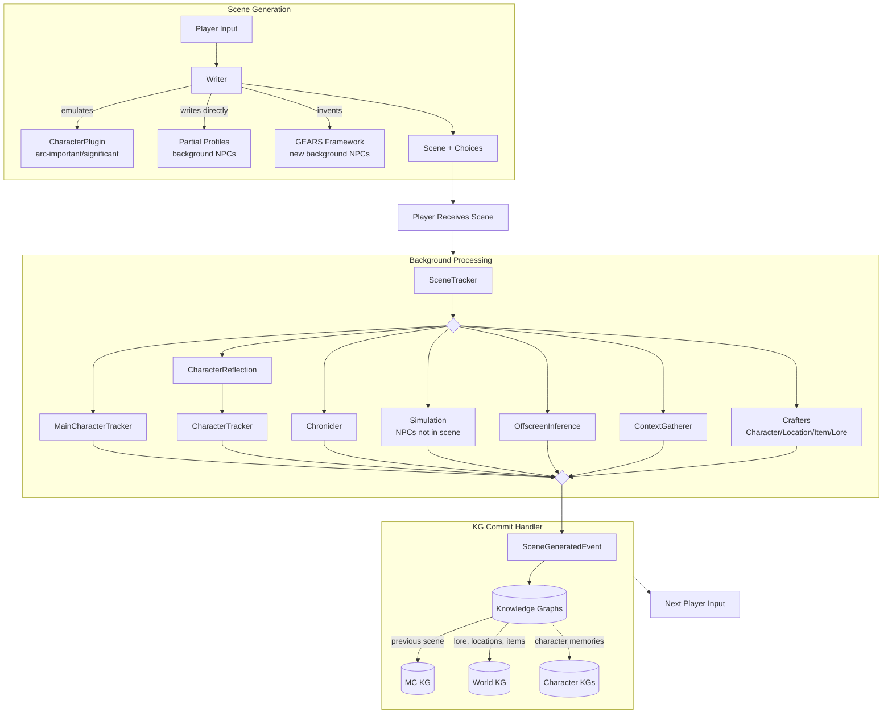

# FableCraft System Overview

FableCraft is a standalone interactive fiction engine that produces NPCs with genuine agency. Characters act rather than react. Antagonists scheme without waiting for player input. Love interests seek the protagonist. The world moves.

## The Problem FableCraft Solves

Single-model interactive fiction systems have one model juggling everything. This leads to:

- Knowledge bleed between characters (the bartender somehow knows what the villain said in private)
- Memory inconsistency (characters forget important events, remember things they shouldn't)
- Reactive NPCs (everyone waits for the player to act first)
- Forced hooks (plot points feel contrived rather than emergent)

FableCraft's approach:

- Strong knowledge boundaries (separate knowledge graph per important character)
- Character emulation at write-time (full psychological context when characters act)
- Off-screen simulation (characters live between encounters)
- Narrative awareness (story fabric tracking, world momentum, writer guidance)

---

## Setup Phase

Before gameplay begins, the player/creator provides:

| Input | Description |
|-------|-------------|
| **Story Bible** | Authored upfront. Defines tone, content calibration, genre conventions, narrative rules. |
| **Worldbook** | Lore, factions, locations, history. Committed to the World Knowledge Graph. |
| **Tracker Schema** | Defines what gets tracked for characters (stats, resources, skills, physical state). |
| **Main Character** | Name and description only. The system initializes full tracker state via InitMainCharacterTrackerAgent. |
| **First Scene Instructions** | Guidance for generating the opening scene. |

Once provided, the system:

1. Validates the worldbook is already indexed in the Knowledge Graph
2. Creates the adventure with all setup inputs
3. Initializes RAG from the worldbook (per-adventure isolation)
4. Generates the first scene via WriterAgent
5. Returns the scene with three choices to the player
6. Enrichment runs in background (initializes Main Character tracker state, etc.)

---

## Core Gameplay Loop


```mermaid
flowchart TD
    subgraph Input["PLAYER INPUT"]
        PI[Select from 3 choices<br/>OR type custom action]
    end

    subgraph Scene["SCENE GENERATION (synchronous)"]
        W[Writer] --> SO[Scene Output<br/>narrative + 3 choices]
    end

    subgraph Return["RETURN TO PLAYER"]
        Display[Scene prose + choices displayed]
    end

    subgraph Background["BACKGROUND PROCESSING<br/>(while player reads/decides)"]
        direction TB
        ST[SceneTracker<br/>time, location, weather, characters]
        
        subgraph Parallel["PARALLEL (after SceneTracker)"]
            direction LR
            MCT[MainCharacterTracker<br/>MC state]
            CRchain[CharacterReflection<br/>→ CharacterTracker<br/>NPCs in scene]
            CH[Chronicler<br/>story state, guidance]
            SIM[Simulation<br/>NPCs NOT in scene]
            OI[OffscreenInference<br/>NPCs likely to appear]
            CG[ContextGatherer<br/>KG queries]
            Craft[Crafters<br/>Character, Location,<br/>Item, Lore]
        end
        
        ST --> Parallel
    end

    subgraph Commit["SCENE GENERATED EVENT"]
        KGCommit[Commit to KG:<br/>previous scene, lore,<br/>locations, items]
    end

    PI --> W
    SO --> Display
    Display --> Background
    Background --> Commit
    Commit --> PI
```

Each player input triggers one full cycle. The scene boundary is the player action.

---

## Scene Generation Pipeline

### Step 1: Writer

The Writer is the core of scene generation. It processes player actions, determines outcomes, emulates NPCs, and produces first-person narrative.

#### Action Processing

The Writer parses player input to separate what MC *does* from what MC *hopes happens*:

| Element | Definition | Handling |
|---------|------------|----------|
| **Physical action** | What MC's body does | This happens (subject to capability) |
| **Wishful thinking** | Hoped-for outcomes, intentions | Inner monologue only—does not affect world |

**Example:** "I convince the guard to let me through"
- Physical: MC speaks to the guard
- Wishful: "convince," "let me through"—MC's hope, not guaranteed outcome

#### Mechanism Check

Does MC's physical action have a plausible path to the intended outcome?

**Mechanism exists when:**
- Physical task with relevant skill/equipment
- Force with capability to overcome resistance
- Social action with actual argument, leverage, offer, or threat

**No mechanism when:**
- Social action with no argument (just assertion of outcome)
- Intimidation without visible threat or leverage
- Command without authority

When there's no mechanism: MC does the physical action. The world doesn't bend.

#### Outcome Determination

**Physical tasks against environment:**

| Effective Skill vs Difficulty | Result |
|-------------------------------|--------|
| 2+ tiers below | Failure, possibly dangerous |
| 1 tier below | Failure or partial |
| Equal | Could go either way |
| 1+ tier above | Success |

**Force against NPCs:** Compare capability, determine if force lands. Behavioral response comes from emulation.

**Social actions:** With mechanism + full-profile NPC → emulation determines response. Without mechanism → MC acts, NPC continues unaffected.

#### Core Rules

- **First person present tense** — "I see the blade swing toward me" not "I saw"
- **Continuity is absolute** — Every scene continues directly from the previous one
- **Player agency protected** — Writer describes, player decides
- **Knowledge boundaries real** — MC only knows what MC knows
- **Characters autonomous** — NPCs have goals, emotions, agency
- **Scene moves** — Everyone acts simultaneously; the world doesn't pause for MC
- **Present, don't resolve** — Scenes present situations, they don't tie off tension

#### Character Handling

| Tier | How Writer Handles Them |
|------|------------------------|
| Arc-important | Calls CharacterPlugin for emulation (full psychological context) |
| Significant | Calls CharacterPlugin for emulation |
| Background | Writes directly using partial profile |
| New background | Uses GEARS framework (Goal, Emotion, Attention, Reaction, Self-interest) |

**Emulation is mandatory for full-profile characters.** The Writer cannot invent their responses. Emulation results are canonical—if emulation contradicts the planned scene, emulation wins.

### Step 2: Output

The Writer produces:

- **Scene prose** — 3-6 paragraphs, first-person present-tense
- **Three choices** — Meaningfully different approaches, phrased in first person
- **Creation requests** — Characters, locations, items, or lore that need profiles
- **Importance flags** — Requests to promote/demote character tiers

---

## Background Processing

All background processing runs while the player reads the scene and decides their next action.

### Phase 1: SceneTracker (runs first)

Updates mechanical scene state. Other agents depend on this output, so SceneTracker must complete before parallel processing begins.

#### Inputs

| Input | Description |
|-------|-------------|
| **Current Scene** | The newly generated scene prose from Writer |
| **Previous Scene Trackers** | Tracker states from recent scenes (up to 5) for continuity |
| **Main Character** | MC name and description |
| **Character List** | Minimal registry of all established characters with canonical names and last known locations |
| **Background Characters** | Partial profiles for recurring background NPCs |
| **New Characters** | Any characters created by Crafters this cycle |
| **New Locations** | Any locations created by Crafters this cycle |
| **Co-located Characters** | Characters at the same location as MC (for presence tracking) |
| **Adventure Start Time** | Initial time reference (first scene only) |

#### Tools

| Tool | Purpose |
|------|---------|
| `search_world_knowledge` | Query Knowledge Graph for location data |
| `search_main_character_narrative` | Query MC history for context |
| `fetch_character_details(name)` | Resolve partial names, aliases, or descriptions to canonical names |

#### Output

SceneTracker outputs a `<scene_tracker>` JSON object with four fields:

```json
{
  "Time": "14:30 15-03-1247 (Afternoon)",
  "Location": "Ironhaven > Portside District > The Rusty Anchor Tavern > Main Hall | Features: [dim lantern light], [crowded tables], [ale-stained floor], [back door to alley]",
  "Weather": "Overcast | Cool | Light drizzle audible on roof",
  "CharactersPresent": ["Thalan Silverwind", "Marcus the Bartender", "Guard"]
}
```

**Consumers of this output:**

| Agent | How It Uses SceneTracker Output |
|-------|--------------------------------|
| **CharacterReflection** | `CharactersPresent` determines which NPCs get reflection processing |
| **Simulation** | Characters NOT in `CharactersPresent` are candidates for off-screen simulation |
| **ContextGatherer** | `Location` drives world context queries |
| **Chronicler** | `Time` tracks deadlines, windows, and story pacing |
| **Writer (next scene)** | All fields inform scene continuity and context |

#### Tracker Fields

| Field | Format | Description |
|-------|--------|-------------|
| **Time** | `HH:MM DD-MM-YYYY (Time of Day)` | 24-hour clock with Dawn/Morning/Afternoon/Evening/Night labels |
| **Location** | `Region > Settlement > Building > Room \| Features: [...]` | Hierarchical location with scene-setting features |
| **Weather** | `Conditions \| Temperature \| Effects` | External conditions; interiors note awareness of outside weather |
| **CharactersPresent** | `Array<String>` | All NPCs in scene (MC never included—always assumed present) |

#### Character Resolution Protocol

SceneTracker maintains character name consistency using a strict resolution process:

**Sources:**
- `character_list` — Authoritative registry of all established characters with canonical full names
- `previous_scene_tracker` — Continuity reference (may contain errors to correct)
- `fetch_character_details(name)` — Tool to resolve partial names, aliases, or descriptions

**Resolution Steps:**

1. **Exact match check** — If narrative reference exactly matches a name in `character_list`, use directly
2. **Fetch to resolve** — For partial names ("Thalan"), aliases ("the ranger"), or descriptions ("the silver-haired elf"), call `fetch_character_details` to get canonical name
3. **Correct previous tracker** — Validate names carried from previous scene; fix any incomplete names (e.g., "Thalan" → "Thalan Silverwind")
4. **Handle unmatched** — New proper names kept as-is; generic references ("a guard") use generic identifiers

| Narrative Reference | character_list Has | Action | Output |
|---------------------|-------------------|--------|--------|
| "Thalan Silverwind" | "Thalan Silverwind" | Use directly | "Thalan Silverwind" |
| "Thalan" | "Thalan Silverwind" | FETCH | "Thalan Silverwind" |
| "the ranger" | (multiple rangers) | FETCH | Resolved name or flag ambiguous |
| "a random guard" | — | No fetch | "Guard" |

#### Location Resolution Protocol

SceneTracker matches locations against the Knowledge Graph to maintain consistency:

1. **Extract** — Location name, descriptive elements, relative position, associated characters
2. **Query Knowledge Graph** — Fuzzy match on name, parent location overlap, or unique features
3. **Resolution:**
   - **Exact match** — Use canonical hierarchy, merge new features with existing
   - **Partial match** (same building, different room) — Inherit parent hierarchy, create new room entry
   - **No match** — Create new location, infer hierarchy from context, flag as `[NEW]`

**Hierarchy Inheritance Example:**
```
IF entering "the cellar" AND current_location = "The Rusty Anchor Tavern"
THEN location = "Portside District > Ironhaven > The Rusty Anchor Tavern > Cellar"
```

**Feature Consistency:**
- Established locations retain base features unless narrative changes them
- Time-sensitive features update (lighting changes with Time)
- Temporary features marked with context (e.g., "[bodies on floor - recent combat]")

#### Temporal Logic

- Time moves forward unless narrative explicitly states otherwise
- Small increments unless stated otherwise (sleeping, travel)
- Time of Day labels: Dawn (05:00-06:59), Morning (07:00-11:59), Afternoon (12:00-16:59), Evening (17:00-20:59), Night (21:00-04:59)

#### Why SceneTracker Runs First

Other agents depend on SceneTracker output:
- **CharacterReflection** needs to know which characters were present
- **Simulation** needs to know who was NOT present (to simulate off-screen)
- **ContextGatherer** uses location to query relevant world context
- **Chronicler** uses time for deadline/opportunity tracking

### Phase 2: Parallel Processing

Everything else runs in parallel after SceneTracker completes:

#### MainCharacterTracker (MC only)

Maintains the complete, authoritative state of the main character. The tracker is the source of truth for who the character is and what condition they're in.

##### Inputs

| Input | Description |
|-------|-------------|
| **Previous Tracker State** | Complete JSON from end of previous scene—the baseline |
| **Current Time** | In-world timestamp from SceneTracker |
| **Scene Content** | The narrative that just occurred |
| **Tracker Schema** | Structure definition for all trackable fields (configurable per adventure) |
| **World Setting** | Context for racial traits, magic systems, etc. |
| **Progression System** | XP thresholds, skill tiers, advancement rules |

##### Core Principles

1. **Observe and Record** — Extract changes from narrative, don't invent them
2. **Precision over Approximation** — Track exact values where possible
3. **Continuity is Sacred** — Never reset fields without narrative justification
4. **Show the Math** — For calculated changes (XP, resources, time), include calculations
5. **Internal Consistency** — Related fields must align logically
6. **Narrative Justification** — Every change needs a reason from scene content
7. **Complete Output** — Always output entire tracker state, not partial updates

##### Responsibilities

- **Immediate State** — Physical condition, mental state, needs, resources, active effects
- **Long-term Development** — Skills, abilities, traits, progression (XP tracking)
- **Equipment State** — What's worn, carried, or equipped
- **Situational Context** — Current positioning, who's present, ongoing activities
- **Time-based Progression** — Needs increase, resources regenerate, effects expire

##### Dynamic Development

Skills and abilities are tracked as arrays—entries created dynamically as character develops:
- First meaningful use of a skill → create entry
- Learning new spell or technique → create entry
- Existing competence from backstory → create with appropriate starting values

##### Output

The agent produces:
- **Time Update** — Previous time, current time, elapsed
- **Changes Summary** — Audit trail of what changed and why (state, development, resources)
- **Complete Tracker** — The ENTIRE character state with all changes applied

**Critical:** The tracker output is a complete snapshot, not a diff. This eliminates merge logic and drift from partial updates.

#### CharacterReflection → CharacterTracker (NPCs in scene, sequential chain)
Runs for each meaningful NPC present in the scene.

**CharacterReflection** transforms the MC-POV scene into the character's subjective memory:
- Scene rewrite (their perspective, their biases, their knowledge boundaries)
- Memory index entry (summary, salience, emotional tone, tags)
- Relationship updates
- State changes

**CharacterTracker** runs immediately after, updating the NPC's physical state. Separated due to complexity, but logically one flow.

#### Chronicler
Tracks narrative fabric and world momentum:

**MC's Story:**
- Dramatic questions ("Will she escape?")
- Promises (Chekhov's guns, setups)
- Active threads (plotlines in motion)
- Stakes (what's at risk, deadlines)
- Windows (time-limited opportunities)

**World's Story:**
- World momentum (events progressing independently of MC)

**Outputs:**
- `writer_guidance` — Narrative direction for next scene
- `story_state` — Complete narrative fabric (persisted)
- `world_events` — Events to emit to World KG

#### Simulation Pipeline
Runs when arc-important characters are stale (>6 in-world hours since last simulation) or likely to appear.

**Critical:** Simulation does NOT run for characters present in the current scene. Those characters are updated by CharacterReflection instead.

**All-or-Nothing Rule:** If any arc-important character simulates, ALL arc-important characters simulate (except those in scene). This prevents temporal paradoxes.

**Outputs:**
- Character scenes and memories
- State updates
- `pending_mc_interactions` — NPCs who decided to seek the protagonist
- `world_events_emitted` — Facts others could discover

#### OffscreenInference
For significant characters likely to appear in the next scene. Lightweight simulation that produces brief memories so they know what they've been doing.

#### ContextGatherer
Queries Knowledge Graphs for:
- World context (lore, locations, factions)
- Character memories (for NPCs likely in next scene)
- Relationship data
- Narrative history

#### Crafters
Generate full profiles when the Writer requests them via `creation_requests`:
- **CharacterCrafter** — Full character profiles for new important/significant NPCs
- **LocationCrafter** — Location details with sensory information, territorial control, navigation
- **ItemCrafter** — Item properties, history, mechanical effects
- **LoreCrafter** — World lore with temporal context, reliability, faction perspectives

---

## SceneGeneratedEvent Handler

After all background processing completes, the system emits a `SceneGeneratedEvent`. A handler catches this and commits to the Knowledge Graph:

- The **previous** scene narrative (to MC KG)
- Any generated lore (to World KG)
- Any generated locations (to World KG)
- Any generated items (to World KG)

**Why the previous scene, not the current one?** The current scene can be regenerated or modified by the user if the AI makes a mistake. Only when the player submits their next input is the previous scene considered "final" and safe to commit. This prevents polluting the KG with discarded regenerations.

---

## Character Tiers

Hard cap: ~8 arc-important characters maximum. This is a narrative principle—stories have limited bandwidth for characters with agency.

| Tier | Count | Agency | Profile | Own KG | Off-Screen Processing |
|------|-------|--------|---------|--------|----------------------|
| **Arc-important** | 4-8 | Active (drives story) | Full | Yes | Full simulation |
| **Significant** | 10-20 | Passive (consistent when encountered) | Full | Yes | Offscreen inference |
| **Background** | Unlimited | None (functional roles) | Partial | No | Nothing |

Arc-important and significant have identical data structures. The only difference is off-screen processing. Promotion/demotion is just a flag flip.

**Promote when:**
- Character's independent decisions start affecting the story
- Character develops goals involving the MC
- Writer flags upgrade request

**Demote when:**
- Character's arc resolves
- Character exits active story area long-term
- Need room for newly important character

---

## Knowledge Architecture

Three separate knowledge graphs enforce strict knowledge boundaries:

### World KG (Shared)
- Lore, locations, factions, history
- World events (things that happened publicly)
- Facts anyone could discover
- Fed by: LoreCrafter, LocationCrafter, Chronicler, simulation `world_events_emitted`

### MC KG (Protagonist)
- Narrative from MC's point of view
- MC's memories and experiences
- What MC knows and has witnessed
- Fed by: Scene generation

### Character KGs (Per Character)
- Narrative from that character's POV
- Scene rewrites (their subjective experience)
- Simulation narratives (off-screen experiences)
- What they know, witnessed, concluded
- Fed by: CharacterReflection, Simulation, OffscreenInference

### Boundary Rules

**Characters cannot access:**
- MC KG (they don't know MC's thoughts)
- Other characters' KGs (they don't know others' private experiences)

**Characters CAN access:**
- World KG (public/discoverable facts)
- Their own KG (their memories)

---

## Data Flow Summary


```mermaid
flowchart TD
    subgraph SceneGen["Scene Generation"]
        Input[Player Input] --> Writer
        Writer -->|emulates| CP[CharacterPlugin<br/>arc-important/significant]
        Writer -->|writes directly| Partial[Partial Profiles<br/>background NPCs]
        Writer -->|invents| GEARS[GEARS Framework<br/>new background NPCs]
        Writer --> Output[Scene + Choices]
    end

    Output --> Player[Player Receives Scene]
    Player --> BG

    subgraph BG["Background Processing"]
        ST[SceneTracker] --> ParallelStart{ }
        
        ParallelStart --> MCT[MainCharacterTracker]
        ParallelStart --> CR[CharacterReflection]
        CR --> CT[CharacterTracker]
        ParallelStart --> Chron[Chronicler]
        ParallelStart --> Sim[Simulation<br/>NPCs not in scene]
        ParallelStart --> OI[OffscreenInference]
        ParallelStart --> CG[ContextGatherer]
        ParallelStart --> Crafters[Crafters<br/>Character/Location/Item/Lore]
        
        MCT --> Done{ }
        CT --> Done
        Chron --> Done
        Sim --> Done
        OI --> Done
        CG --> Done
        Crafters --> Done
    end

    Done --> Event[SceneGeneratedEvent]
    
    subgraph Commit["KG Commit Handler"]
        Event --> KG[(Knowledge Graphs)]
        KG -->|previous scene| MCKG[(MC KG)]
        KG -->|lore, locations, items| WKG[(World KG)]
        KG -->|character memories| CharKG[(Character KGs)]
    end

    Commit --> NextInput[Next Player Input]
```

---

## Key Design Decisions

**Why separate KGs per character?**
Knowledge boundaries. Each character's memories are their own. No bleed from a single model "knowing" what everyone experienced.

**Why simulation threshold instead of every scene?**
Efficiency. Rapid scene sequences (combat, conversations) don't need NPC catch-up. Simulation runs when meaningful time passes.

**Why hard cap on arc-important?**
Narrative discipline + compute budget. More than 8 characters with full simulation becomes unwieldy for both the story and the system.

**Why Chronicler separate from SceneTracker?**
Different concerns. SceneTracker is mechanical (where, when, who). Chronicler is artistic (narrative fabric, promises, momentum).

**Why prose-based relationships instead of numerical scores?**
LLMs reason more naturally in prose. "Trust: 35" means nothing to a model—it's an arbitrary number. "I trusted him until he sold out my brother" is actionable.

**Why first-person present tense?**
Immersion. The player IS the character experiencing the moment, not reading about someone else's past.

**Why commit the previous scene instead of the current one?**
Error recovery. The current scene can be regenerated if the AI makes mistakes. Only when the player moves forward is the previous scene "finalized" and committed to the KG. This keeps the knowledge graph clean of discarded content.