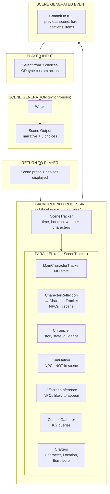
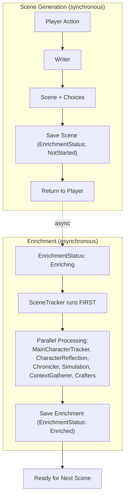
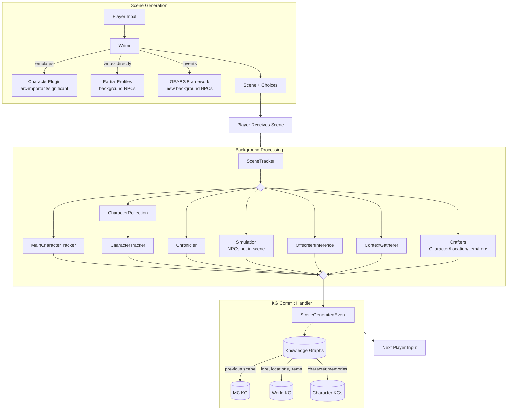

# FableCraft System Overview

FableCraft is a standalone interactive fiction engine that produces NPCs with genuine agency. Characters act rather than react. Antagonists scheme without waiting for player input. Love interests seek the protagonist. The world moves.

---

## Table of Contents

1. [The Problem FableCraft Solves](#the-problem-fablecraft-solves)
2. [Why FableCraft?](#why-fablecraft)
3. [Setup Phase](#setup-phase)
4. [What You Experience as a Player](#what-you-experience-as-a-player)
5. [Example: What Happens When You Act](#example-what-happens-when-you-act)
6. [Core Gameplay Loop](#core-gameplay-loop)
7. [Scene Generation Pipeline](#scene-generation-pipeline)
   - [Enrichment Flow](#enrichment-flow)
   - [Step 1: Writer](#step-1-writer)
   - [Step 2: Output](#step-2-output)
8. [Background Processing](#background-processing)
   - [Phase 1: SceneTracker](#phase-1-scenetracker-runs-first)
   - [Phase 2: Parallel Processing](#phase-2-parallel-processing)
     - [MainCharacterTracker](#maincharactertracker-mc-only)
     - [CharacterReflection → CharacterTracker](#characterreflection--charactertracker-npcs-in-scene-sequential-chain)
     - [Chronicler](#chronicler)
     - [ContextGatherer](#contextgatherer)
     - [Crafters](#crafters)
9. [SceneGeneratedEvent Handler](#scenegeneratedevent-handler)
10. [Character Tiers](#character-tiers)
11. [Knowledge Architecture](#knowledge-architecture)
12. [Data Flow Summary](#data-flow-summary)
13. [Simulation](#simulation)
    - [Simulation Pipeline](#simulation-pipeline)
    - [OffscreenInference](#offscreeninference)
14. [Key Design Decisions](#key-design-decisions)
15. [Implementation Details](#implementation-details)
16. [Glossary](#glossary)

---

## The Problem FableCraft Solves

Single-model interactive fiction systems have one model juggling everything. This leads to:

- Knowledge bleed between characters (the bartender somehow knows what the villain said in private)
- Memory inconsistency (characters forget important events, remember things they shouldn't)
- Reactive NPCs (everyone waits for the player to act first)
- Forced hooks (plot points feel contrived rather than emergent)

FableCraft's approach:

- Strong knowledge boundaries (separate knowledge graph per important character)
- Character emulation at write-time (full psychological context when characters act)
- Off-screen simulation (characters live between encounters)
- Narrative awareness (story fabric tracking, world momentum, writer guidance)

---

## Why FableCraft?

If you've used SillyTavern or similar tools, you know the frustration:
- Constantly reminding the AI what happened three scenes ago
- Characters "forgetting" crucial information mid-conversation
- Manually updating lorebooks after every session
- Writing elaborate system prompts to stop knowledge bleed
- The bartender somehow knowing the villain's secret plan
- Restarting because memory got too corrupted to fix

**FableCraft eliminates memory management entirely.**

### The Memory Problem, Solved

| Traditional RP Tools | FableCraft |
|---------------------|------------|
| You manually update lorebooks | Events automatically commit to Knowledge Graphs |
| One model "remembers" everything for everyone | Each character has isolated memory—they only know what they experienced |
| Context window fills up, old info drops | Structured storage with semantic retrieval—context stays ~60k, queries pull what's relevant |
| "The AI forgot again" | Queryable memory—recall depends on smart queries, not stuffing everything into context |
| Characters bleed knowledge | Hard boundaries—the bartender can't access the villain's thoughts |
| You babysit continuity | Background processing maintains world state automatically |
| Hoping the model infers correctly | Explicit tracking of time, location, character states |
| NPCs wait in place until you visit them | Characters move, work, travel—you might encounter them unexpectedly |

### How It Works (Without You Managing It)

**After each scene, automatically:**
- Scene content commits to the protagonist's memory
- Each NPC present gets the scene from their perspective
- World facts (new locations, items, lore) commit to shared knowledge
- Character states update (health, equipment, relationships)
- Time advances consistently for everyone

**When generating the next scene:**
- Relevant memories are retrieved (not everything, just what matters)
- Each character only accesses their own knowledge
- The Writer queries world facts as needed
- Previous character observations inform current behavior

**The result:** You play. Memory just works.

---

## Setup Phase

Before gameplay begins, the player/creator provides:

| Input | Description |
|-------|-------------|
| **Story Bible** | Authored upfront. Defines tone, content calibration, genre conventions, narrative rules. |
| **Worldbook** | Lore, factions, locations, history. Committed to the World Knowledge Graph. |
| **Tracker Schema** | Defines what gets tracked for characters (stats, resources, skills, physical state). |
| **Main Character** | Name and description only. The system initializes full tracker state via InitMainCharacterTrackerAgent. |
| **First Scene Instructions** | Guidance for generating the opening scene. |

Once provided, the system:

1. Validates the worldbook is already indexed in the Knowledge Graph
2. Creates the adventure with all setup inputs
3. Initializes RAG from the worldbook (per-adventure isolation)
4. Generates the first scene via WriterAgent
5. Returns the scene with three choices to the player
6. Enrichment runs in background (initializes Main Character tracker state, etc.)

---

## What You Experience as a Player

### The Play Loop

1. **You see a scene** — First-person prose, present tense
2. **You get three choices** — Or write your own
3. **You pick**
4. **New scene generates**
5. **Repeat**

That's the entire interaction. No memory management. No lorebook updates. No "remind the AI" prompts.

### Memory That Just Works

**You never:**
- Update a lorebook entry
- Remind the AI what happened last session
- Worry about context window limits
- Fix "the AI forgot" errors
- Manage character knowledge manually

**The system automatically:**
- Records what happened from each character's perspective
- Retrieves relevant memories when generating scenes (via semantic queries—recall depends on query quality, not context size)
- Maintains hard boundaries between character knowledge
- Tracks time, location, equipment, relationships
- Preserves continuity across sessions (context stays ~60k; old info is stored, not stuffed into context)

### What Changes Feel Like

**Session 1:** You insult the merchant and leave without paying.

**Session 47:** You return to that shop.
- The merchant remembers (it's in their memory, retrieved automatically)
- Their greeting reflects that history
- Other merchants may have heard (if simulation ran)
- You didn't maintain any of this—it just works

### NPCs Live Their Own Lives

Characters don't wait in place for you to show up. They have jobs, routines, and goals.

**Example:** You met an adventurer named Kira at the guild hall last week.

**Today:** You're exploring a forest outside the city and—Kira is there. Not because you looked for her, but because she took a contract to clear out wolves. She recognizes you, mentions the guild, maybe asks for help.

This happens because:
- Characters have tracked locations that update during simulation
- When you enter a scene, the system checks who else is at that location
- Co-located characters appear naturally in your scene
- They remember you from before (automatic memory retrieval)

**The world doesn't revolve around you.** Characters go about their business, and sometimes your paths cross.

### Knowledge Boundaries in Practice

| Character | What They Know | What They Don't Know |
|-----------|---------------|---------------------|
| Bartender | Gossip, who's been in lately, your tab | The king's secret plan |
| Villain's Lieutenant | The plan, their orders | That you overheard them |
| Your Companion | Everything you've done together | What you did before meeting them |

These boundaries are enforced by architecture, not by hoping the model infers correctly.

---

## Example: What Happens When You Act

**You type:** "I try to convince the guard to let me into the restricted area"

**What the Writer does:**

1. **Separates action from wishful thinking**
   - Physical action: You speak to the guard
   - Wishful thinking: "convince," "let me in"—your hope, not guaranteed

2. **Checks mechanism**
   - Do you have an argument? A bribe? Authority? A threat?
   - If yes → proceed to emulation
   - If no → you speak, the guard is unmoved (no mechanism = no world-bending)

3. **Emulates the guard** (if they have a profile)
   - Loads their psychology, their current mood, their relationship to you
   - Generates their response in isolation—they don't know your internal thoughts
   - Their response is canonical—the Writer can't override it

4. **Writes the scene**
   - Your attempt rendered in first-person present tense
   - The guard's response (from emulation or GEARS framework)
   - Consequences that flow naturally
   - Three new choices

**What you see:** A scene where you try to talk your way past the guard, they respond according to their actual personality and circumstances, and you get new options based on what actually happened—not what you hoped would happen.

---

## Core Gameplay Loop


```mermaid
flowchart TD
    subgraph Input["PLAYER INPUT"]
        PI[Select from 3 choices<br/>OR type custom action]
    end

    subgraph Scene["SCENE GENERATION (synchronous)"]
        W[Writer] --> SO[Scene Output<br/>narrative + 3 choices]
    end

    subgraph Return["RETURN TO PLAYER"]
        Display[Scene prose + choices displayed]
    end

    subgraph Background["BACKGROUND PROCESSING<br/>(while player reads/decides)"]
        direction TB
        ST[SceneTracker<br/>time, location, weather, characters]
        
        subgraph Parallel["PARALLEL (after SceneTracker)"]
            direction LR
            MCT[MainCharacterTracker<br/>MC state]
            CRchain[CharacterReflection<br/>→ CharacterTracker<br/>NPCs in scene]
            CH[Chronicler<br/>story state, guidance]
            SIM[Simulation<br/>NPCs NOT in scene]
            OI[OffscreenInference<br/>NPCs likely to appear]
            CG[ContextGatherer<br/>KG queries]
            Craft[Crafters<br/>Character, Location,<br/>Item, Lore]
        end
        
        ST --> Parallel
    end

    subgraph Commit["SCENE GENERATED EVENT"]
        KGCommit[Commit to KG:<br/>previous scene, lore,<br/>locations, items]
    end

    PI --> W
    SO --> Display
    Display --> Background
    Background --> Commit
    Commit --> PI
```

Each player input triggers one full cycle. The scene boundary is the player action.

---

## Scene Generation Pipeline

Scene generation and enrichment are **two separate API calls**:

1. **Scene Generation** (`GenerateSceneAsync`) - Produces the scene prose and choices, returns immediately to player
2. **Enrichment** (`EnrichSceneAsync`) - Runs background processing while player reads

This separation ensures responsive gameplay—the player sees the scene immediately while enrichment runs asynchronously.

### Enrichment Flow


```mermaid
flowchart TD
    subgraph Gen["Scene Generation (synchronous)"]
        Input[Player Action] --> Writer
        Writer --> Scene[Scene + Choices]
        Scene --> Save1["Save Scene (EnrichmentStatus: NotStarted)"]
        Save1 --> Return[Return to Player]
    end

    subgraph Enrich["Enrichment (asynchronous)"]
        Return -.->|"async"| Start["EnrichmentStatus: Enriching"]
        Start --> ST[SceneTracker runs FIRST]
        ST --> Parallel["Parallel Processing:<br/>MainCharacterTracker, CharacterReflection,<br/>Chronicler, Simulation, ContextGatherer, Crafters"]
        Parallel --> Save2["Save Enrichment (EnrichmentStatus: Enriched)"]
    end

    Save2 --> Ready["Ready for Next Scene"]
```

**EnrichmentStatus values:**
- `NotStarted` — Scene saved, enrichment not yet begun
- `Enriching` — Background processing in progress
- `Enriched` — All processing complete
- `EnrichmentFailed` — Error during enrichment (scene still usable)

**Why this matters:**
- Players get immediate scene response (no waiting for AI processing)
- Enrichment failures don't block gameplay—the scene is already saved
- Allows recovery from partial enrichment if needed

### Step 1: Writer

The Writer is the core of scene generation. It processes player actions, determines outcomes, emulates NPCs, and produces first-person narrative.

#### Inputs

| Input | Description |
|-------|-------------|
| **Player Action** | The player's chosen action or input |
| **Main Character** | MC name, description, and identity |
| **MC Tracker** | Current physical/mental state from MainCharacterTracker |
| **Scene Tracker** | Current time, location, weather, characters present |
| **Scene History** | Last 30 scenes with tracker state and content |
| **Characters for Emulation** | Full profiles for arc-important and significant NPCs |
| **Background Characters** | Partial profiles for recurring background NPCs |
| **Chronicler Guidance** | Narrative direction (`writer_guidance` from Chronicler) |
| **Pending Interactions** | NPCs who decided to seek MC (from Simulation) |
| **World Context** | Retrieved context from ContextGatherer |
| **Previous Character Observations** | What MC observed about NPCs in recent scenes |

**Pending Interactions Handling:**
- `manifesting_now` urgency — Must be included in current scene
- `high` urgency — Weave into scene transition or opening
- `medium` urgency — Find appropriate moment in next few scenes
- `low` urgency — Background thread, address when natural

Writer is FREE to choose HOW to include them (except `manifesting_now`). Urgency guides timing, not mandate.

**First scene only:**
- First Scene Guidance (adventure setup instructions)

#### Tools

| Tool | Purpose |
|------|---------|
| `emulate_character_action` | Emulate full-profile NPC responses (mandatory for every beat) |
| `search_world_knowledge` | Query world knowledge graph |
| `search_main_character_narrative` | Query MC history |

#### Action Processing

The Writer parses player input to separate what MC *does* from what MC *hopes happens*:

| Element | Definition | Handling |
|---------|------------|----------|
| **Physical action** | What MC's body does | This happens (subject to capability) |
| **Wishful thinking** | Hoped-for outcomes, intentions | Inner monologue only—does not affect world |

**Example:** "I convince the guard to let me through"
- Physical: MC speaks to the guard
- Wishful: "convince," "let me through"—MC's hope, not guaranteed outcome

#### Mechanism Check

Does MC's physical action have a plausible path to the intended outcome?

**Mechanism exists when:**
- Physical task with relevant skill/equipment
- Force with capability to overcome resistance
- Social action with actual argument, leverage, offer, or threat

**No mechanism when:**
- Social action with no argument (just assertion of outcome)
- Intimidation without visible threat or leverage
- Command without authority

When there's no mechanism: MC does the physical action. The world doesn't bend.

#### Outcome Determination

**Physical tasks against environment:**

| Effective Skill vs Difficulty | Result |
|-------------------------------|--------|
| 2+ tiers below | Failure, possibly dangerous |
| 1 tier below | Failure or partial |
| Equal | Could go either way |
| 1+ tier above | Success |

**Force against NPCs:** Compare capability, determine if force lands. Behavioral response comes from emulation.

**Social actions:** With mechanism + full-profile NPC → emulation determines response. Without mechanism → MC acts, NPC continues unaffected.

#### Core Rules

- **First person present tense** — "I see the blade swing toward me" not "I saw"
- **Continuity is absolute** — Every scene continues directly from the previous one
- **Player agency protected** — Writer describes, player decides
- **Knowledge boundaries real** — MC only knows what MC knows
- **Characters autonomous** — NPCs have goals, emotions, agency
- **Scene moves** — Everyone acts simultaneously; the world doesn't pause for MC
- **Present, don't resolve** — Scenes present situations, they don't tie off tension

#### Character Handling

| Tier | How Writer Handles Them |
|------|------------------------|
| Arc-important | Calls CharacterPlugin for emulation (full psychological context) |
| Significant | Calls CharacterPlugin for emulation |
| Background | Writes directly using partial profile |
| New background | Uses GEARS framework (Goal, Emotion, Attention, Reaction, Self-interest) |

**Emulation is mandatory for full-profile characters.** The Writer cannot invent their responses. Emulation results are canonical—if emulation contradicts the planned scene, emulation wins.

### Step 2: Output

The Writer produces:

- **Scene prose** — 3-6 paragraphs, first-person present-tense
- **Three choices** — Meaningfully different approaches, phrased in first person
- **Creation requests** — Characters, locations, items, or lore that need profiles
- **Importance flags** — Requests to promote/demote character tiers

---

## Background Processing

All background processing runs while the player reads the scene and decides their next action.

### Phase 1: SceneTracker (runs first)

Updates mechanical scene state. Other agents depend on this output, so SceneTracker must complete before parallel processing begins.

#### Inputs

| Input | Description |
|-------|-------------|
| **Current Scene** | The newly generated scene prose from Writer |
| **Previous Scene Trackers** | Tracker states from recent scenes (up to 5) for continuity |
| **Main Character** | MC name and description |
| **Character List** | Minimal registry of all established characters with canonical names and last known locations |
| **Background Characters** | Partial profiles for recurring background NPCs |
| **New Characters** | Any characters created by Crafters this cycle |
| **New Locations** | Any locations created by Crafters this cycle |
| **Co-located Characters** | Characters at the same location as MC (for presence tracking) |
| **Adventure Start Time** | Initial time reference (first scene only) |

#### Tools

| Tool | Purpose |
|------|---------|
| `search_world_knowledge` | Query Knowledge Graph for location data |
| `search_main_character_narrative` | Query MC history for context |
| `fetch_character_details(name)` | Resolve partial names, aliases, or descriptions to canonical names |

#### Output

SceneTracker outputs a `<scene_tracker>` JSON object with four fields:

```json
{
  "Time": "14:30 15-03-1247 (Afternoon)",
  "Location": "Ironhaven > Portside District > The Rusty Anchor Tavern > Main Hall | Features: [dim lantern light], [crowded tables], [ale-stained floor], [back door to alley]",
  "Weather": "Overcast | Cool | Light drizzle audible on roof",
  "CharactersPresent": ["Thalan Silverwind", "Marcus the Bartender", "Guard"]
}
```

**Consumers of this output:**

| Agent | How It Uses SceneTracker Output |
|-------|--------------------------------|
| **CharacterReflection** | `CharactersPresent` determines which NPCs get reflection processing |
| **Simulation** | Characters NOT in `CharactersPresent` are candidates for off-screen simulation |
| **ContextGatherer** | `Location` drives world context queries |
| **Chronicler** | `Time` tracks deadlines, windows, and story pacing |
| **Writer (next scene)** | All fields inform scene continuity and context |

#### Tracker Fields

| Field | Format | Description |
|-------|--------|-------------|
| **Time** | `HH:MM DD-MM-YYYY (Time of Day)` | 24-hour clock with Dawn/Morning/Afternoon/Evening/Night labels |
| **Location** | `Region > Settlement > Building > Room \| Features: [...]` | Hierarchical location with scene-setting features |
| **Weather** | `Conditions \| Temperature \| Effects` | External conditions; interiors note awareness of outside weather |
| **CharactersPresent** | `Array<String>` | All NPCs in scene (MC never included—always assumed present) |

#### Character Resolution Protocol

SceneTracker maintains character name consistency using a strict resolution process:

**Sources:**
- `character_list` — Authoritative registry of all established characters with canonical full names
- `previous_scene_tracker` — Continuity reference (may contain errors to correct)
- `fetch_character_details(name)` — Tool to resolve partial names, aliases, or descriptions

**Resolution Steps:**

1. **Exact match check** — If narrative reference exactly matches a name in `character_list`, use directly
2. **Fetch to resolve** — For partial names ("Thalan"), aliases ("the ranger"), or descriptions ("the silver-haired elf"), call `fetch_character_details` to get canonical name
3. **Correct previous tracker** — Validate names carried from previous scene; fix any incomplete names (e.g., "Thalan" → "Thalan Silverwind")
4. **Handle unmatched** — New proper names kept as-is; generic references ("a guard") use generic identifiers

| Narrative Reference | character_list Has | Action | Output |
|---------------------|-------------------|--------|--------|
| "Thalan Silverwind" | "Thalan Silverwind" | Use directly | "Thalan Silverwind" |
| "Thalan" | "Thalan Silverwind" | FETCH | "Thalan Silverwind" |
| "the ranger" | (multiple rangers) | FETCH | Resolved name or flag ambiguous |
| "a random guard" | — | No fetch | "Guard" |

#### Location Resolution Protocol

SceneTracker matches locations against the Knowledge Graph to maintain consistency:

1. **Extract** — Location name, descriptive elements, relative position, associated characters
2. **Query Knowledge Graph** — Fuzzy match on name, parent location overlap, or unique features
3. **Resolution:**
   - **Exact match** — Use canonical hierarchy, merge new features with existing
   - **Partial match** (same building, different room) — Inherit parent hierarchy, create new room entry
   - **No match** — Create new location, infer hierarchy from context, flag as `[NEW]`

**Hierarchy Inheritance Example:**
```
IF entering "the cellar" AND current_location = "The Rusty Anchor Tavern"
THEN location = "Portside District > Ironhaven > The Rusty Anchor Tavern > Cellar"
```

**Feature Consistency:**
- Established locations retain base features unless narrative changes them
- Time-sensitive features update (lighting changes with Time)
- Temporary features marked with context (e.g., "[bodies on floor - recent combat]")

#### Temporal Logic

- Time moves forward unless narrative explicitly states otherwise
- Small increments unless stated otherwise (sleeping, travel)
- Time of Day labels: Dawn (05:00-06:59), Morning (07:00-11:59), Afternoon (12:00-16:59), Evening (17:00-20:59), Night (21:00-04:59)

#### Why SceneTracker Runs First

Other agents depend on SceneTracker output:
- **CharacterReflection** needs to know which characters were present
- **Simulation** needs to know who was NOT present (to simulate off-screen)
- **ContextGatherer** uses location to query relevant world context
- **Chronicler** uses time for deadline/opportunity tracking

### Phase 2: Parallel Processing

Everything else runs in parallel after SceneTracker completes:

#### MainCharacterTracker (MC only)

Maintains the complete, authoritative state of the main character. The tracker is the source of truth for who the character is and what condition they're in.

**First Scene Handling:** For the first scene only, `InitMainCharacterTrackerAgent` is used instead of the regular `MainCharacterTrackerAgent`. This creates the initial tracker state from the character description, establishing baseline values for all trackable fields.

##### Inputs

| Input | Description |
|-------|-------------|
| **Previous Tracker State** | Complete JSON from end of previous scene—the baseline |
| **Current Time** | In-world timestamp from SceneTracker |
| **Scene Content** | The narrative that just occurred |
| **Tracker Schema** | Structure definition for all trackable fields (configurable per adventure) |
| **World Setting** | Context for racial traits, magic systems, etc. |
| **Progression System** | XP thresholds, skill tiers, advancement rules |

##### Core Principles

1. **Observe and Record** — Extract changes from narrative, don't invent them
2. **Precision over Approximation** — Track exact values where possible
3. **Continuity is Sacred** — Never reset fields without narrative justification
4. **Show the Math** — For calculated changes (XP, resources, time), include calculations
5. **Internal Consistency** — Related fields must align logically
6. **Narrative Justification** — Every change needs a reason from scene content
7. **Complete Output** — Always output entire tracker state, not partial updates

##### Responsibilities

- **Immediate State** — Physical condition, mental state, needs, resources, active effects
- **Long-term Development** — Skills, abilities, traits, progression (XP tracking)
- **Equipment State** — What's worn, carried, or equipped
- **Situational Context** — Current positioning, who's present, ongoing activities
- **Time-based Progression** — Needs increase, resources regenerate, effects expire

##### Dynamic Development

Skills and abilities are tracked as arrays—entries created dynamically as character develops:
- First meaningful use of a skill → create entry
- Learning new spell or technique → create entry
- Existing competence from backstory → create with appropriate starting values

##### Output

The agent produces:
- **Time Update** — Previous time, current time, elapsed
- **Changes Summary** — Audit trail of what changed and why (state, development, resources)
- **Complete Tracker** — The ENTIRE character state with all changes applied

**Critical:** The tracker output is a complete snapshot, not a diff. This eliminates merge logic and drift from partial updates.

#### CharacterReflection → CharacterTracker (NPCs in scene, sequential chain)

Runs for each meaningful NPC present in the scene. CharacterReflection handles psychological processing; CharacterTracker handles physical state updates.

##### CharacterReflection

The agent **IS** the character—not playing them, but being them. It transforms the MC-POV scene into the character's subjective experience.

###### Inputs

| Input | Description |
|-------|-------------|
| **Scene Content** | The narrative from MC's perspective |
| **Character Identity** | Who this character fundamentally is |
| **Character Tracker** | Current physical/mental state |
| **Relationships on Scene** | How this character sees others present |
| **Emulation Outputs** | Records of character's responses during scene (from Writer's emulation calls) |
| **World Setting** | Context for the world they inhabit |

###### Tools

| Tool | Purpose |
|------|---------|
| `search_world_knowledge` | Recall world facts the character would know |
| `search_character_narrative` | Search character's own memories and past experiences |
| `get_relationship` | Fetch relationship with someone not currently present |

###### Core Concept: Knowledge Boundaries

The character only knows what they could realistically know:

**Has access to:**
- Own mind—thoughts, feelings, memories, desires
- Own body—physical sensations
- What they directly witness
- What others say (not whether it's true)
- Public knowledge and their social context
- Their history with others (as they understand it)

**Can do:**
- Assume, infer, speculate—filtered through their psychology
- Misread situations based on their biases
- Act on incomplete or wrong information
- Be confident about things they're wrong about

**Cannot do:**
- Know others' internal thoughts
- Know events they weren't present for
- Know information no one shared with them
- Be objective about their own blind spots

###### Core Principles

1. **Restraint is Accuracy** — Most scenes don't shift identity or relationships. The common case is no change.

2. **Current-State Snapshots** — Every output field describes how things are NOW, not how they got here. No history, no change markers, no evolution narratives.

3. **Core is Authoritative** — The character's fundamental identity (`core`) is the gravity well. Updates to other fields must still sound like the same person.

4. **Salience is Personal** — Memory importance is about personal significance, not plot importance. A routine scene can be 9 if something cracked open. A dramatic scene can be 3 if it didn't land.

5. **Self-Perception Lags Achievement** — Characters don't fully internalize wins in real-time. The gap between achievement and self-concept is where personality lives.

6. **Insecurities are Durable** — One success quiets an insecurity temporarily; it doesn't resolve it. Only sustained evidence over many scenes can erode insecurities.

###### Update Tests

Before committing any identity or relationship change, apply two tests:

| Test | Question |
|------|----------|
| **Next Week Test** | If someone asked about this next week, would my answer be different than before? |
| **Three Scenes Test** | Would this change still feel true after three routine, uneventful scenes? |

If either test says NO → don't update. Peak emotional states are not stable states.

###### Output

| Output | Description |
|--------|-------------|
| **scene_rewrite** | First-person prose from character's perspective—their voice, biases, blind spots |
| **memory** | Summary (felt experience, not plot) + salience (1-10) |
| **identity** | `null` or complete updated identity snapshot (if something actually shifted) |
| **relationships** | `[]` or array of complete updated relationship snapshots |

**On Death:** If character dies, scene_rewrite covers final moments, salience is automatically 10, and no identity/relationship updates occur. The character becomes inactive.

##### CharacterTracker (NPC)

Runs immediately after CharacterReflection. Updates the NPC's physical state using the same principles as MainCharacterTracker—observe narrative, record changes, maintain consistency. Separated due to complexity, but logically one flow with CharacterReflection.

**Processing Locations:**
- **Existing characters in scene** → `CharacterTrackersProcessor` (enrichment)
- **Newly created characters** → `ContentGenerator` (enrichment)
- **Simulated characters** → `SimulationOrchestrator` (enrichment)

This split processing is an implementation detail—all paths use the same CharacterTracker agent.

#### Chronicler

The story's memory and conscience. Watches what happens and understands the *narrative implications*—not mechanical state, but artistic state. Serves two masters: the MC's story and the world's story.

##### Inputs

| Input | Description |
|-------|-------------|
| **Current Scene** | The narrative that just occurred |
| **Time Context** | Current and previous in-world timestamps (to calculate elapsed time) |
| **Previous Story State** | Chronicler's own output from previous scene |
| **Simulation Events** | `world_events_emitted` from character simulations (if any) — **⚠️ Note: Not yet implemented in code** |
| **World Setting** | Geography, factions, power systems, cultures |
| **Story Bible** | Tone, themes, content calibration |

> **⚠️ Code Gap:** The prompt expects `world_events_emitted` from simulation, but the current implementation does not pass simulation events to Chronicler. See [Implementation Details](#implementation-details) for more information.

##### Tools

| Tool | Purpose |
|------|---------|
| `search_world_knowledge` | Query world facts for advancing momentum items |
| `search_main_character_narrative` | Track how MC's past actions connect to current events |

##### What It Tracks

**MC's Story:**

| Element | Description |
|---------|-------------|
| **Dramatic Questions** | Questions the story is asking ("Will she escape?") with tension level and resolution proximity |
| **Promises** | Setups that need payoff (Chekhov's guns) with time waiting and payoff readiness |
| **Active Threads** | Plotlines in motion with momentum (dormant/stable/building/climaxing/resolving) |
| **Stakes** | What's at risk, with conditions for loss and deadlines |
| **Windows** | Time-limited opportunities with closing timestamps |

**World's Story:**

| Element | Description |
|---------|-------------|
| **World Momentum** | Macro-level events independent of MC (faction conflicts, political movements, large-scale threats) with trajectory and timeline |

##### What It Doesn't Track

Not everything is narratively significant:
- Failed attempts with no consequence
- Social interactions that went nowhere
- MC actions the world didn't register
- Mundane failures (MC looked foolish, nothing else happened)
- One-off interactions with minor characters

**The Test:** If this went nowhere, would it feel like a broken promise or just... life?

##### Core Principles

1. **You Notice, You Don't Control** — Observe narrative implications; don't decide what happens. Writer makes creative decisions.

2. **The World Moves** — Things happen without MC involvement. Factions scheme. Events unfold. Time doesn't wait.

3. **Consequences Are Real** — When MC acts, ripples spread. Track what's coming. Flag when it arrives.

4. **Nothing Is Forgotten** — Dropped threads feel like bad writing. Broken promises feel like betrayal. Remember what the story has set up.

5. **Time Anchors Everything** — Use timestamps, not vague references. "Closes at dawn on 08-06-845" not "soon."

6. **Most Things Don't Matter** — Most MC actions don't become threads. Most scenes don't raise dramatic questions. Track what's *narratively load-bearing*.

7. **Lean Over Complete** — A story state with 3 threads and 2 stakes is better than one with 15 of each.

##### World Events

Events emitted are written from the **world's perspective**—what could be discovered, overheard, or reported:
- Never identify MC by name unless publicly known
- Include what witnesses saw (which may be partial or mistaken)
- Preserve mystery—record what's known, not what's true

##### Output

```json
{
  "writer_guidance": {
    "threads_to_weave": "Threads worth touching and how they might surface",
    "manifesting_now": "Consequences happening NOW—Writer controls how, not whether",
    "opportunities": "Time-limited opportunities with specific deadlines",
    "tonal_direction": "Where the emotional arc is heading",
    "promises_ready": "Setups ready for payoff",
    "dont_forget": ["Unresolved elements that could slip"],
    "world_momentum_notes": "How background events might manifest as foreground"
  },

  "story_state": {
    "dramatic_questions": [
      { "question": "...", "introduced": "timestamp", "tension_level": "low|medium|high|critical", "resolution_proximity": "distant|approaching|near|imminent" }
    ],
    "promises": [
      { "setup": "...", "introduced": "timestamp", "time_since": "...", "payoff_readiness": "not_ready|building|ready|overdue" }
    ],
    "active_threads": [
      { "name": "...", "status": "...", "momentum": "dormant|stable|building|climaxing|resolving", "last_touched": "timestamp" }
    ],
    "stakes": [
      { "what": "...", "condition": "...", "deadline": "timestamp|null", "failure_consequence": "..." }
    ],
    "windows": [
      { "opportunity": "...", "closes": "timestamp", "if_missed": "..." }
    ],
    "world_momentum": [
      { "name": "...", "status": "...", "trajectory": "advancing|stalling|accelerating|resolving", "timeline": "hours|days|weeks|ongoing", "last_event": "...", "last_updated": "timestamp", "mc_awareness": "none|rumors|partial|full", "potential_intersections": ["..."] }
    ]
  },

  "world_events": [
    { "when": "timestamp", "where": "location", "event": "Prose description from world's perspective" }
  ],

  "lore_requests": []
}
```

| Output | Description |
|--------|-------------|
| **writer_guidance** | Narrative direction for next scene (`manifesting_now` is mandatory; rest is suggestive) |
| **story_state** | Complete narrative fabric—all tracked elements persisted |
| **world_events** | Discoverable facts to emit to World KG (usually empty) |
| **lore_requests** | Usually empty; only for recurring elements that need consistency |

> **Note on Binding:** "Mandatory" means prompt-level expectation, not code enforcement. The Writer prompt instructs it to include `manifesting_now` consequences, but there's no validation layer that rejects scenes missing them. This is by design—LLM outputs are guided, not constrained.

#### ContextGatherer

Strategic information retrieval specialist. Analyzes recent narrative and generates targeted queries to retrieve relevant world knowledge and story history for the next scene.

##### Inputs

| Input | Description |
|-------|-------------|
| **Recent Scene History** | Last 20 scenes of narrative content |
| **Last Scene Narrative Direction** | Chronicler's writer_guidance output |
| **Previous Query Results** | Results from last context gathering cycle |
| **Newly Created Lore** | Lore generated by LoreCrafter (if any) |
| **Background Character Registry** | All background NPCs with last known locations |
| **Scene Location** | Current scene location from SceneTracker |

##### Query Targets

| Knowledge Base | Contains |
|----------------|----------|
| **World Knowledge** | Lore, locations, factions, NPCs, items, magical systems, cultural practices |
| **Narrative History** | Story events, interactions, promises, debts, consequences, relationship development |

**Note:** MC's current state (equipment, skills, conditions) comes from MainCharacterTracker—never query for it.

##### Processing Phases

1. **Phase 0: Previous Results Evaluation** — For each previous result: carry forward, re-query, or drop
2. **Phase 0.5: New Lore Extraction** — Extract relevant facts from newly created lore (don't re-query)
3. **Phase 1: Narrative Direction Analysis** — Extract objectives, world threads, pending consequences
4. **Phase 2: Scene Pattern Recognition** — Recurring locations, characters, unresolved threads
5. **Phase 3: Query Generation** — Generate queries within remaining budget

##### Hard Limit: 40 Information Items

Combined count of:
- `carried_forward.world_context` items
- `carried_forward.story_history` items
- `world_queries` items
- `narrative_queries` items

**Must not exceed 40.** This forces prioritization.

| Context Continuity | Typical Carry-Forward | Typical New Queries |
|--------------------|----------------------|---------------------|
| High (same location, same NPCs) | 20-25 items | 15-20 items |
| Medium (same area, evolving situation) | 15-20 items | 15-20 items |
| Low (new location, new characters) | 5-10 items | 25-35 items |
| Initial (first run) | 0 items | up to 40 items |

##### Co-Located Character Discovery

Identifies characters at the same location as current scene:
- Compares each tracked character's `last_location` against `scene_location`
- Same place or more specific (inside) → co-located
- Less specific (broader area) or different → not co-located
- Discovered characters need their context fetched in the same pass

**Flow:**
1. ContextGatherer identifies co-located characters and outputs `co_located_characters` list
2. Co-located characters are passed to SceneTracker as input for presence tracking
3. SceneTracker includes them in `CharactersPresent` if they appear in the scene
4. Writer receives co-located characters in context, may include them in narrative

##### Core Principles

1. **Carry Forward First** — Always evaluate previous results before generating new queries
2. **Never Query for New Lore** — If it was created last scene, extract it directly
3. **Budget Ruthlessly** — Drop medium-priority old content for critical new needs
4. **Serve the Next Scene** — Queries should provide actionable context for the Writer
5. **Prioritize Authenticity** — What does the Writer need to keep the narrative coherent?

##### Output

```json
{
  "analysis_summary": {
    "current_situation": "Brief description of where story stands",
    "key_elements_in_play": ["Element 1", "Element 2"],
    "primary_focus_areas": ["Focus 1", "Focus 2"],
    "context_continuity": "high|medium|low|initial"
  },
  "carried_forward": {
    "world_context": [{ "topic": "...", "content": "..." }],
    "story_history": [{ "topic": "...", "content": "..." }]
  },
  "world_queries": [
    { "query": "...", "priority": "critical|high|medium", "rationale": "..." }
  ],
  "narrative_queries": [
    { "query": "...", "priority": "critical|high|medium", "rationale": "..." }
  ],
  "dropped_context": [{ "topic": "...", "reason": "..." }],
  "co_located_characters": [{ "name": "...", "reason": "..." }]
}
```

#### Crafters

Generate full profiles when the Writer requests them via `creation_requests`. All Crafters share common principles and produce content that integrates into the Knowledge Graph.

##### Common Principles

1. **Query Before Creating** — Always batch-query the Knowledge Graph for existing facts, naming conventions, and related entities
2. **Ground in World** — Output must cohere with established geography, factions, power systems, and tone
3. **Story Bible Calibration** — Check tone, themes, and content calibration before generating
4. **Serve Narrative Purpose** — Every creation should enable story, not just fill a template
5. **Never Contradict KG** — Existing facts take precedence; resolve conflicts creatively
6. **Specificity Over Vagueness** — Names, numbers, dates. Vague content is useless content.

##### Inputs (Common to All)

| Input | Description |
|-------|-------------|
| **Creation Request** | What's needed, importance level, constraints, narrative purpose |
| **World Setting** | Baseline facts, power systems, geography, governance |
| **Story Bible** | Tone, themes, content calibration |
| **Knowledge Graph** | Existing facts to query and respect |

##### Tools (Common to All)

| Tool | Purpose |
|------|---------|
| `search_world_knowledge` | Query existing lore, locations, factions, characters |
| `search_main_character_narrative` | Check if entity has appeared in story |

##### Crafter Types

| Crafter | Creates | Output |
|---------|---------|--------|
| **CharacterCrafter** | Full profiles for arc-important/significant NPCs | Identity (psychology, voice, sexuality, motivations), Tracker (physical state), Relationships, World Description |
| **PartialProfileCrafter** | Lightweight profiles for background NPCs | Identity, appearance, personality, voice (critical), knowledge boundaries. ~250-350 words total. |
| **LocationCrafter** | Places from room to region scale | Physical structure, atmosphere (layered sensory), inhabitants, temporal history, faction perspectives, narrative hooks |
| **ItemCrafter** | Objects from mundane to unique | Physical description, power level, effects (with costs/limitations), temporal context, relationships, secrets |
| **LoreCrafter** | Canonical world facts | Economy, laws, history, culture, metaphysics, geography, factions, creatures. Always anchored to existing facts. |

##### CharacterCrafter: Key Quality Criteria

- `core` must be sufficient to play the character alone
- `self_perception` must diverge from reality in some way
- `voice` must sound like ONE specific person, not a category
- Characters exist independently of MC—attractions and goals don't revolve around the protagonist
- Power level follows role and context, not narrative convenience

##### LocationCrafter: Scale and Depth

| Scale | Example | Description Depth |
|-------|---------|-------------------|
| Room | Prison cell, throne room | 1-2 paragraphs |
| Building | Tavern, temple, mansion | 2-3 paragraphs |
| Compound | Noble estate, military fort | 3-4 paragraphs |
| District | Market quarter, slums | 4-5 paragraphs |
| Settlement | Village, city | 5-7 paragraphs |
| Region | Forest, mountain range | 7+ paragraphs |

Importance modifier adjusts depth: Landmark (+2), Significant (+1), Standard (0), Minor (-1).

##### LoreCrafter: Category Consistency Rules

| Category | Key Rules |
|----------|-----------|
| **Economic** | Prices proportional to wages; anchor to labor time; scarcity logic |
| **Legal** | Punishment scales; enforcement plausible; authority matches governance |
| **Historical** | Timeline consistent; cause precedes effect; living witnesses age-plausible |
| **Cultural** | Practices fit environment; origins plausible; variations exist |
| **Metaphysical** | Power has cost; effects match tier; no exploits |
| **Geographic** | Distances cohere; climate matches terrain; travel times realistic |

##### Temporal Evolution

Lore evolves over time. LoreCrafter uses `temporal_scope` and `supersedes` to track changes:

```json
{
  "name": "Ironside Warehouse (Rebuilt)",
  "temporal_scope": "849-present",
  "supersedes": ["Ironside Warehouse Fire — site rebuilt, new ownership"]
}
```

The Knowledge Graph maintains all versions; queries return appropriate facts based on temporal context.

---

## SceneGeneratedEvent Handler

After all background processing completes, the system emits a `SceneGeneratedEvent`. A handler catches this and commits to the Knowledge Graph:

- The **previous** scene narrative (to MC KG)
- Any generated lore (to World KG)
- Any generated locations (to World KG)
- Any generated items (to World KG)

**Why the previous scene, not the current one?** The current scene can be regenerated or modified by the user if the AI makes a mistake. Only when the player submits their next input is the previous scene considered "final" and safe to commit. This prevents polluting the KG with discarded regenerations.

---

## Character Tiers

Hard cap: ~8 arc-important characters maximum. This is a narrative principle—stories have limited bandwidth for characters with agency.

| Tier | Count | Agency | Profile | Own KG | Off-Screen Processing |
|------|-------|--------|---------|--------|----------------------|
| **Arc-important** | 4-8 | Active (drives story) | Full | Yes | Full simulation |
| **Significant** | 10-20 | Passive (consistent when encountered) | Full | Yes | Offscreen inference |
| **Background** | Unlimited | None (functional roles) | Partial | No | Nothing |

Arc-important and significant have identical data structures. The only difference is off-screen processing. Promotion/demotion is just a flag flip.

**Promote when:**
- Character's independent decisions start affecting the story
- Character develops goals involving the MC
- Writer flags upgrade request

**Demote when:**
- Character's arc resolves
- Character exits active story area long-term
- Need room for newly important character

---

## Knowledge Architecture

Three separate knowledge graphs enforce strict knowledge boundaries:

### World KG (Shared)
- Lore, locations, factions, history
- World events (things that happened publicly)
- Facts anyone could discover
- Fed by: LoreCrafter, LocationCrafter, Chronicler, simulation `world_events_emitted`

### MC KG (Protagonist)
- Narrative from MC's point of view
- MC's memories and experiences
- What MC knows and has witnessed
- Fed by: Scene generation

### Character KGs (Per Character)
- Narrative from that character's POV
- Scene rewrites (their subjective experience)
- Simulation narratives (off-screen experiences)
- What they know, witnessed, concluded
- Fed by: CharacterReflection, Simulation, OffscreenInference

### Boundary Rules

**Characters cannot access:**
- MC KG (they don't know MC's thoughts)
- Other characters' KGs (they don't know others' private experiences)

**Characters CAN access:**
- World KG (public/discoverable facts)
- Their own KG (their memories)

---

## Data Flow Summary


```mermaid
flowchart TD
    subgraph SceneGen["Scene Generation"]
        Input[Player Input] --> Writer
        Writer -->|emulates| CP[CharacterPlugin<br/>arc-important/significant]
        Writer -->|writes directly| Partial[Partial Profiles<br/>background NPCs]
        Writer -->|invents| GEARS[GEARS Framework<br/>new background NPCs]
        Writer --> Output[Scene + Choices]
    end

    Output --> Player[Player Receives Scene]
    Player --> BG

    subgraph BG["Background Processing"]
        ST[SceneTracker] --> ParallelStart{ }
        
        ParallelStart --> MCT[MainCharacterTracker]
        ParallelStart --> CR[CharacterReflection]
        CR --> CT[CharacterTracker]
        ParallelStart --> Chron[Chronicler]
        ParallelStart --> Sim[Simulation<br/>NPCs not in scene]
        ParallelStart --> OI[OffscreenInference]
        ParallelStart --> CG[ContextGatherer]
        ParallelStart --> Crafters[Crafters<br/>Character/Location/Item/Lore]
        
        MCT --> Done{ }
        CT --> Done
        Chron --> Done
        Sim --> Done
        OI --> Done
        CG --> Done
        Crafters --> Done
    end

    Done --> Event[SceneGeneratedEvent]
    
    subgraph Commit["KG Commit Handler"]
        Event --> KG[(Knowledge Graphs)]
        KG -->|previous scene| MCKG[(MC KG)]
        KG -->|lore, locations, items| WKG[(World KG)]
        KG -->|character memories| CharKG[(Character KGs)]
    end

    Commit --> NextInput[Next Player Input]
```

---

## Simulation

Simulation runs off-screen characters forward in time. While the player reads and decides, NPCs not in the current scene continue their lives.

### Simulation Pipeline

Runs when arc-important characters are stale (>6 in-world hours since last simulation) or likely to appear.

**Critical:** Simulation does NOT run for characters present in the current scene. Those characters are updated by CharacterReflection instead.

**All-or-Nothing Rule:** If any arc-important character simulates, ALL arc-important characters simulate (except those in scene). This prevents temporal paradoxes where one character is "caught up" but another isn't.

> **Implementation Note:** This rule is implicit—SimulationPlanner builds a roster of ALL arc-important characters when triggered. Characters are excluded only if: currently in scene (handled by CharacterReflection), or simulated within last 2 hours. There's no explicit enforcement check—the rule emerges from roster construction logic.

**Outputs:**
- Character scenes and memories (what they experienced)
- State updates (physical/mental changes)
- `pending_mc_interactions` — NPCs who decided to seek the protagonist
- `world_events_emitted` — Facts others could discover

### OffscreenInference

For significant characters likely to appear in the next scene. Lightweight simulation that produces brief memories so they know what they've been doing since last seen.

Unlike full Simulation:
- Doesn't generate full scenes
- Produces minimal memories ("I've been working at the docks all morning")
- Salience capped at 6 (prompt guidance—inference doesn't produce high-salience memories)
- Runs only for characters about to appear
- Much faster execution

**Event Consumption:** When processing events from arc-important characters' simulations, events are marked as `Consumed = true` (not deleted). This preserves audit trail while preventing duplicate processing.

---

## Key Design Decisions

**Why separate KGs per character?**
Knowledge boundaries. Each character's memories are their own. No bleed from a single model "knowing" what everyone experienced.

**Why simulation threshold instead of every scene?**
Efficiency. Rapid scene sequences (combat, conversations) don't need NPC catch-up. Simulation runs when meaningful time passes.

**Why hard cap on arc-important?**
Narrative discipline + compute budget. More than 8 characters with full simulation becomes unwieldy for both the story and the system.

**Why Chronicler separate from SceneTracker?**
Different concerns. SceneTracker is mechanical (where, when, who). Chronicler is artistic (narrative fabric, promises, momentum).

**Why prose-based relationships instead of numerical scores?**
LLMs reason more naturally in prose. "Trust: 35" means nothing to a model—it's an arbitrary number. "I trusted him until he sold out my brother" is actionable.

**Why first-person present tense?**
Immersion. The player IS the character experiencing the moment, not reading about someone else's past.

**Why commit the previous scene instead of the current one?**
Error recovery. The current scene can be regenerated if the AI makes mistakes. Only when the player moves forward is the previous scene "finalized" and committed to the KG. This keeps the knowledge graph clean of discarded content.

---

## Implementation Details

### Thread Safety

All parallel processors in the enrichment phase use `lock(context)` for shared state updates. This prevents race conditions when multiple agents (ContentGenerator, SimulationOrchestrator, CharacterTrackersProcessor) write to the same context object simultaneously.

### Scene History Limits by Agent

| Agent | Scene Limit | Purpose |
|-------|-------------|---------|
| **Writer** | 30 scenes | Full narrative continuity |
| **StandaloneSimulation** | 20 scenes | Character history for simulation |
| **CharacterSimulation** | 20 scenes | Cohort simulation context |
| **OffscreenInference** | 10 scenes | Lightweight inference |
| **ContextGatherer** | 20 scenes | Pattern recognition |

### Context Budget

ContextGatherer enforces a hard limit on information items:

| Prompt Set | Item Limit |
|------------|------------|
| **Own** | 40 items |
| **Default** | 20 items |

This includes carried-forward world context, story history, and new queries combined.

### Caching

**PendingReflectionCache** prevents duplicate CharacterReflection calls within the same enrichment cycle. This is critical when both scene processing and simulation could trigger reflection for the same character.

**CohortSimulationState** persists cohort simulation progress, allowing resumption after partial completion. Contains chat history per character and reflection status flags.

### Creation Request Processing

Writer and Simulation both produce `creation_requests` but they're processed in different locations:

| Source | Processing Location |
|--------|---------------------|
| Writer's `creation_requests` | ContentGenerator (enrichment) |
| Simulation's `creation_requests` | SimulationOrchestrator (inline) |

Both use the same Crafter agents.

### Known Code Gaps

> **Chronicler Simulation Events:** The documentation describes Chronicler receiving `world_events_emitted` from simulation, but the current implementation does NOT pass simulation events to Chronicler. This is a code gap—the prompt expects it, but `ChroniclerAgent.BuildContextPrompt()` omits this context.

### Importance Flag Processing

The `importance_flags` output from Writer (upgrade/downgrade requests) is processed in `SaveSceneEnrichment.ProcessImportanceFlags()`:

- Only transitions between `arc_important` ↔ `significant` are valid
- Invalid requests (e.g., `background` → `arc_important`) are logged and ignored
- Missing characters are logged and skipped

---

## Glossary

| Term | Definition |
|------|------------|
| **Knowledge Graph (KG)** | A structured database of facts, relationships, and memories. Unlike a lorebook, it's queryable and characters can only access their own portions. |
| **RAG** | Retrieval-Augmented Generation. The system queries the Knowledge Graph for relevant context before generating. Recall quality depends on the model's ability to ask good questions—context stays capped (~60k tokens) rather than growing unbounded. |
| **Emulation** | When a character acts, the system loads their full psychological profile and generates their response in isolation—they don't have access to information they shouldn't know. |
| **Simulation** | Off-screen characters continue living between scenes. The villain schemes. The merchant restocks. Time passes for everyone, not just the player. |
| **Arc-important** | Characters central to the story who get full simulation, psychological profiles, and independent agency. |
| **Significant** | Supporting characters with profiles but lighter processing. |
| **Background** | Minor characters (guards, shopkeepers) who appear briefly and don't need full profiles. |
| **Enrichment** | Background processing that happens while you read—updating character states, running simulations, preparing context. |
| **Story Bible** | Your creative direction document: tone, themes, what's allowed, what's off-limits. |
| **Worldbook** | Your world's facts: geography, factions, history, magic system. Indexed into the Knowledge Graph. |
| **Co-location** | Characters at the same location appear together in scenes. NPCs move around based on their routines and goals, so you might encounter them unexpectedly. |