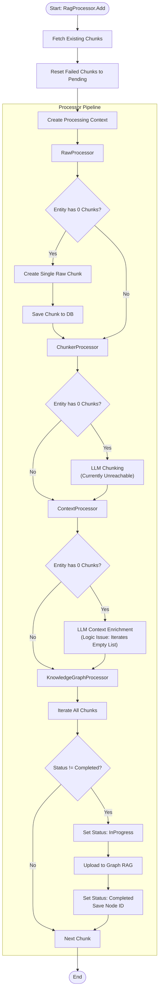

# RAG Processing Documentation

This document outlines the current architecture and workflow of the RAG (Retrieval-Augmented Generation) processing pipeline located in `FableCraft.Infrastructure/Rag`.

## Overview

The RAG processing system is responsible for ingesting entities (such as knowledge graph nodes), processing their textual content, and uploading them to an external Graph RAG service. The system handles chunking, context enrichment (conceptually), and synchronization with the external service.

### Knowledge Graph Provider

This system uses **[Graphiti](https://github.com/getzep/graphiti)** as the knowledge graph provider.

### Workflow Design Inspiration

The workflow design was inspired by two key sources:

1. **Chunking Strategy**: The approach of chunking articles into multiple episodes to generate more detailed knowledge graphs with richer node and edge extraction, as described in [Getzep's blog post on building a Russian election interference knowledge graph](https://blog.getzep.com/building-a-russian-election-interference-knowledge-graph/#:~:text=Chunking%20articles%20into%20multiple%20Episodes%20improved%20our%20results%20compared%20to%20treating%20each%20article%20as%20a%20single%20Episode.%20This%20approach%20generated%20more%20detailed%20knowledge%20graphs%20with%20richer%20node%20and%20edge%20extraction%2C%20while%20single%2DEpisode%20processing%20produced%20only%20high%2Dlevel%2C%20sparse%20graphs). This approach improved results compared to treating each article as a single episode, which produced only high-level, sparse graphs.

2. **Contextual Retrieval**: The concept of enriching chunks with contextual information to improve retrieval accuracy, based on [Anthropic's contextual retrieval approach](https://www.anthropic.com/engineering/contextual-retrieval?ref=blog.getzep.com).

## Architecture

The core of the system is the `RagProcessor`, which orchestrates a pipeline of `ITextProcessorHandler` implementations.

### Key Components

*   **`RagProcessor`**: The main entry point. It prepares the processing context, manages the state of chunks (resetting failed ones), and executes the registered handlers sequentially.
*   **`RawProcessor`**: Handles initial ingestion of new entities by creating a single "raw" chunk containing the full text.
*   **`ChunkerProcessor`**: Intended to split text into smaller semantic chunks using an LLM.
*   **`ContextProcessor`**: Intended to enrich chunks with contextual information using an LLM to improve retrieval.
*   **`KnowledgeGraphProcessor`**: Uploads the processed chunks to the external Graph RAG service and updates their status.

## Processing Pipeline Flow

The handlers are registered and executed in the following order:
1.  `RawProcessor`
2.  `ChunkerProcessor`
3.  `ContextProcessor`
4.  `KnowledgeGraphProcessor`

### Logic Visualization

## Detailed Handler Logic

### 1. RawProcessor
*   **Trigger**: Entities that currently have **0** chunks associated with them.
*   **Action**: Creates a single `Chunk` containing the entire text of the entity (`RawChunk`).
*   **Outcome**: The chunk is saved to the database with `ProcessingStatus.Pending`.
*   **Note**: Since this runs first for new entities, it effectively populates the chunk list, influencing subsequent processors.

### 2. ChunkerProcessor
*   **Trigger**: Entities that have **0** chunks.
*   **Intended Action**: Use an LLM to intelligently split the text into smaller, semantically coherent chunks.
*   **Current Behavior**: Because `RawProcessor` runs first and adds a chunk to all new entities, this processor determines that the chunk count is `> 0` and **skips processing**.

### 3. ContextProcessor
*   **Trigger**: Entities that have **0** chunks.
*   **Intended Action**: Use an LLM to add a summary context to the chunk to aid retrieval.
*   **Current Behavior**:
    *   If `RawProcessor` ran: It sees chunks exist and **skips**.
    *   Logic Issue: The code attempts to iterate over chunks of entities that have 0 chunks. Since there are no chunks to iterate, the loop body is effectively a no-op even if the condition was met.

### 4. KnowledgeGraphProcessor
*   **Trigger**: All chunks in the context.
*   **Action**:
    *   Filters out chunks that are already `Completed`.
    *   Sets status to `InProgress`.
    *   Sends the chunk content (Reference: `Chunk.GetContent()`) to the configured Graph RAG service via `_ragBuilder`.
    *   On success: Updates status to `Completed` and saves the returned `DataId` as `KnowledgeGraphNodeId`.
    *   On failure: Updates status to `Failed` and logs the error.

## Data Model

### Chunk Entity
The `Chunk` entity (`FableCraft.Infrastructure.Persistence.Entities.Chunks`) stores the processing state:
*   `RawChunk`: The original text.
*   `ContextualizedChunk`: (Optional) Enriched context text.
*   `ProcessingStatus`: Enum (`Pending`, `InProgress`, `Completed`, `Failed`).
*   `KnowledgeGraphNodeId`: ID returned by the external RAG service.

When content is sent to the external service, `GetContent()` is used:
*   If `ContextualizedChunk` is present: Returns `ContextualizedChunk + "\n\n" + RawChunk`.
*   Otherwise: Returns `RawChunk`.
