# RAG Knowledge System

This document explains how FableCraft remembers and retrieves story information using a knowledge graph.

## What is RAG?

RAG (Retrieval-Augmented Generation) is a system that helps the AI "remember" what happened in your adventure. Instead of relying only on the current conversation, the AI can search through past scenes, character information, and world details to generate more consistent and contextual responses.

Think of it as the AI's long-term memory for your story.

## System Overview

## Types of Datasets

Each adventure has multiple "datasets" - organized collections of knowledge that the AI can search through.

### World Dataset
**Contains:** Lorebook entries (locations, items, lore, world rules)

**Purpose:** Stores everything about the world itself - places, objects, customs, and background information that applies to the entire adventure.

**Example content:**
- "The Silver Tankard is a tavern in the merchant district, known for its honey mead"
- "Dragons in this world cannot breathe fire underwater"

---

### Main Character Dataset
**Contains:** Scene narratives, main character description

**Purpose:** Stores the story from the main character's perspective. This is the primary narrative thread of the adventure.

**Example content:**
- Scene 5: The hero entered the castle and spoke with the king
- Main character is brave, carries a silver sword, has a scar on left cheek

---

### Character Datasets (one per NPC)
**Contains:** Character-specific scene rewrites, character states, character descriptions

**Purpose:** Each non-player character (NPC) gets their own dataset. This stores how they experienced scenes and their current state.

**Example content:**
- From the merchant's perspective: "A stranger entered my shop asking about the ancient map"
- Character state: Currently suspicious of the hero, knows about the hidden passage

---

## When is Data Committed?

Data is **not** saved to the knowledge graph immediately. It waits until certain conditions are met.

### Commit Trigger
When a **new scene is generated**, the system checks if there are any previous scenes that haven't been committed yet. If so, it commits them.

### Why Wait?
The system commits scenes that come **before** the current scene. This ensures:
- The most recent scene can still be edited or regenerated
- Only "finalized" story content enters the knowledge graph
- The AI won't find information about the current scene when searching

---

## What Data Gets Committed?

When scenes are committed, several types of data are processed:

### 1. Lorebook Entries → World Dataset
Any new lorebook entries created during the scene (new locations, items, lore) are added to the world dataset.

### 2. Scene Narrative → Main Character Dataset
The scene itself, along with context like:
- Scene number
- Current time and location
- Weather
- Which characters were present

### 3. Character Rewrites → Character Datasets
Each NPC's perspective of the scene goes to their personal dataset. This includes:
- How the character experienced the events
- The scene from their point of view

### 4. Character States → Character + Main Datasets
Updated character descriptions and states are saved to:
- The character's own dataset
- The main character dataset (so the hero knows about NPCs too)

### 5. Main Character Description
The main character's current description is updated across all datasets so every character "knows" who the hero is.

---

## The Commit Process

Here's what happens step-by-step when scenes are committed:

---

## How the AI Uses This Data

The AI has access to three separate **search tools** (plugins), one for each dataset type. When generating content, the AI decides which tool to use based on what information it needs.

```mermaid
flowchart TB
    subgraph AI["AI Agent"]
        Agent[Scene Generator / Character Agent]
    end

    subgraph Tools["Available Search Tools"]
        WT["World Knowledge Tool"]
        MT["Main Character Tool"]
        CT["Character Narrative Tool"]
    end

    subgraph Datasets["Knowledge Graph"]
        WD[("World\nDataset")]
        MD[("Main Character\nDataset")]
        CD[("Character\nDataset")]
    end

    Agent -->|"Where is the Silver Tankard?"| WT
    Agent -->|"What did the hero do last time?"| MT
    Agent -->|"How does the merchant feel?"| CT

    WT --> WD
    MT --> MD
    CT --> CD
```

### Search Tools

| Tool | What It Searches | Example Questions |
|------|------------------|-------------------|
| **World Knowledge** | Locations, lore, items, events, world-building | "What is the history of the old tower?" |
| **Main Character Narrative** | Hero's memories, goals, relationships, journey | "What are the hero's motivations?" |
| **Character Narrative** | NPC's memories, relationships, personal history | "What does this character remember about the hero?" |

### How a Search Works

1. **AI decides it needs information** - For example, "I need to know about this tavern"
2. **AI picks the right tool** - World Knowledge tool for location info
3. **AI sends queries** - Can send multiple questions at once
4. **AI specifies detail level** - Brief, detailed, or comprehensive
5. **Results return** - AI uses this context in its response

### Query Limits

Each tool has a **maximum of 10 queries per generation** to prevent overuse. If the limit is reached, the AI must work with the information it already has.

### Example: Generating a Scene at the Tavern

