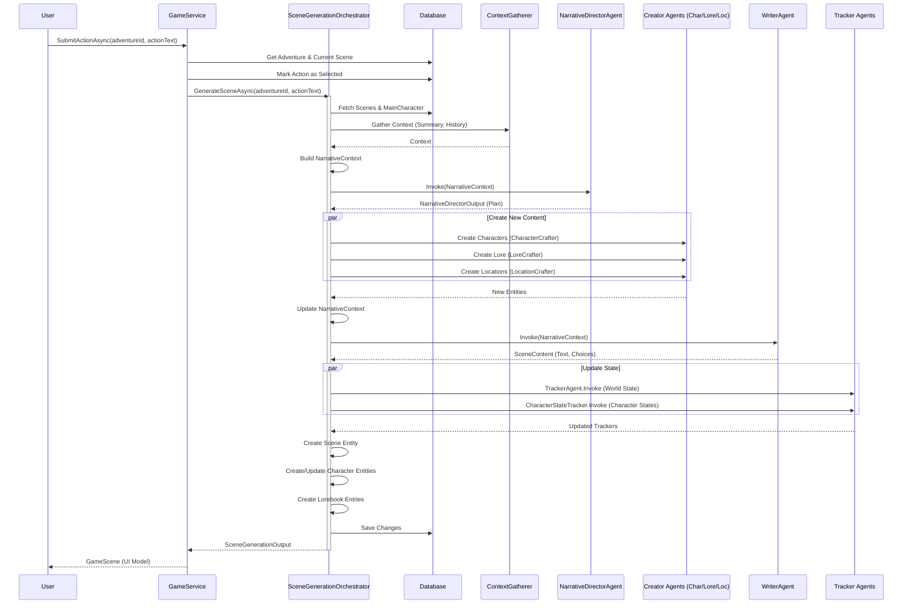

# Simulation: Adding a New Scene

This process describes how the system handles a user action to generate a new scene. It involves the `GameService`, the `SceneGenerationOrchestrator`, and various AI agents.

### Process Overview

1.  **User Action**: The user submits an action (e.g., "I open the door").
2.  **Action Submission**: `GameService` finds the current scene and marks the selected action.
3.  **Orchestration**: `SceneGenerationOrchestrator` takes over.
4.  **Context Gathering**: Relevant context is gathered from the DB and Knowledge Graph.
5.  **Narrative Direction**: The `NarrativeDirectorAgent` decides what happens next (new characters, locations, lore).
6.  **Content Creation**: New entities (Characters, Lore, Locations) are created if needed.
7.  **Writing**: The `WriterAgent` generates the narrative text.
8.  **Tracking**: The `TrackerAgent` and `CharacterStateTracker` update the world and character states.
9.  **Persistence**: The new scene and all updated/new entities are saved to the database.

### Agents & Responsibilities

The following AI Agents are involved in the scene generation process. Each agent handles a specific domain of the narrative generation.

| Agent | Responsibility | Plugins / Tools |
| :--- | :--- | :--- |
| **NarrativeDirectorAgent** | **Orchestration & Planning**. Acts as the "Game Master". Analyzes context and user action to decide the narrative flow. It outputs a high-level plan (`NarrativeDirectorOutput`) including scene direction and requests for new content (characters, lore, locations). | `KnowledgeGraphPlugin` |
| **WriterAgent** | **Content Generation**. Acts as the "Ghostwriter". Takes the narrative plan, context, and new content to generate the actual prose of the scene (text) and the available choices for the user. | `CharacterPlugin`, `KnowledgeGraphPlugin` |
| **TrackerAgent** | **World State Tracking**. Maintains the global state of the adventure, such as current location, weather, time of day, and list of characters present in the scene. | None (Prompt-based) |
| **CharacterStateTracker** | **Character State Tracking**. Updates the specific state and statistics of individual characters (e.g., health, inventory, mood) based on the events of the generated scene. | None (Prompt-based) |
| **CharacterCrafter** | **Content Creation**. Generates detailed profiles for new characters when requested by the Narrative Director. Creates stats, descriptions, and initial tracker states. | `KnowledgeGraphPlugin` |
| **LoreCrafter** | **Content Creation**. Generates new lore entries (history, items, concepts) when requested. | `KnowledgeGraphPlugin` |
| **LocationCrafter** | **Content Creation**. Generates details for new locations when the story moves to a previously undefined place. | `KnowledgeGraphPlugin` |

### Sequence Diagram

