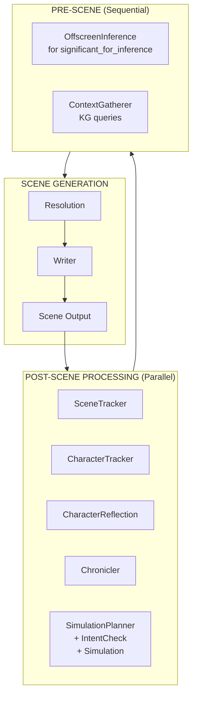
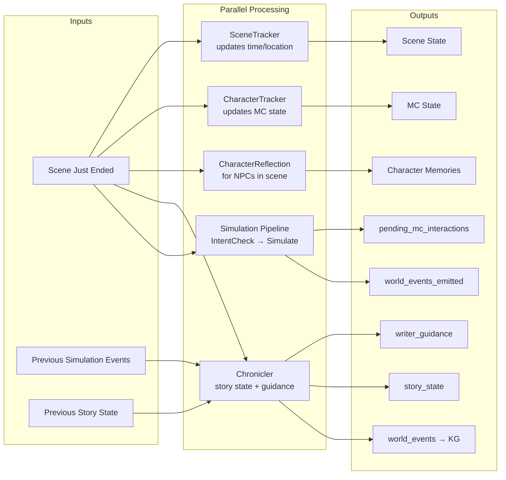
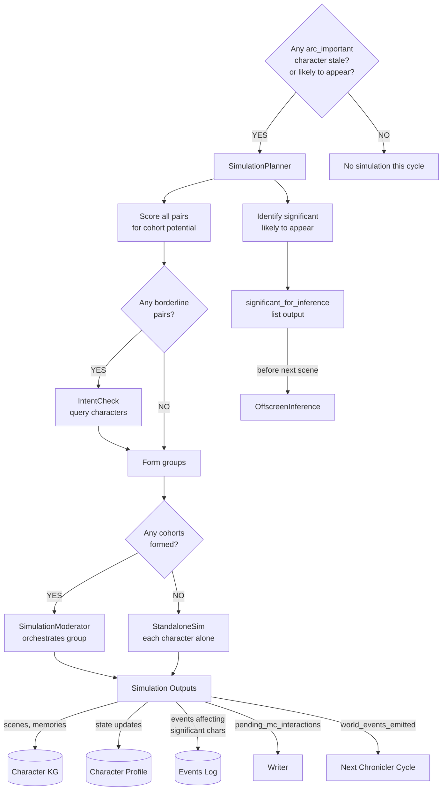
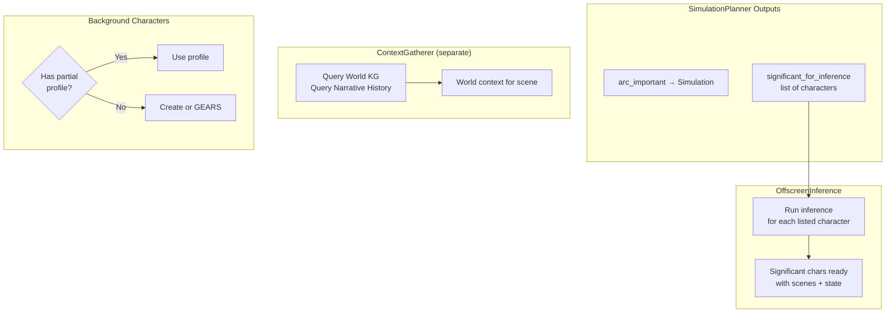

# NPC Simulation System Design

## Knowledge Graph Architecture

The system maintains strict knowledge boundaries through three separate knowledge graphs:

### World KG (Shared)
- Lore, locations, factions, history
- World events (things that happened in the world)
- Facts anyone could discover or learn about
- Fed by: LoreCrafter, LocationCrafter, Chronicler, simulation `world_events_emitted`

### MC KG (Protagonist)
- Narrative from MC's point of view
- MC's memories and experiences
- What MC knows and has witnessed
- Fed by: Scene generation, MC's perspective

### Character KGs (Per Character)
- Narrative from that character's point of view
- Scene rewrites (their subjective experience of MC scenes)
- Simulation narratives (their off-screen experiences)
- What they know, have witnessed, have concluded
- Fed by: CharacterReflection, Simulation outputs, OffscreenInference outputs

### Boundary Rules

**Characters cannot access:**
- MC KG (they don't know MC's thoughts)
- Other characters' KGs (they don't know others' private experiences)

**Characters CAN access:**
- World KG (public/discoverable facts)
- Their own KG (their memories)

**During simulation, characters can query:**
- World KG — to inform decisions with world facts
- Their own KG — to recall their experiences and what they've learned

**When characters emit to World KG:**
- Action has visible consequences (fire, destruction, death)
- Information becomes public or discoverable
- Something changes in shared reality

---

## North Star

**Goal:** NPCs with genuine agency. Characters who act, not just react. Antagonists who scheme without waiting for MC input. Love interests who seek the MC. A world that moves.

**Problem with single-model systems (e.g., SillyTavern):** One model juggles everything, leading to:
- Knowledge bleed between characters
- Memory inconsistency
- Reactive instead of proactive NPCs
- Hooks feel forced rather than emergent

**Our approach:**
- Strong knowledge boundaries (separate KG per important character)
- Emulation at write-time (CharacterPlugin with full context)
- Simulation for off-screen progression (characters live between encounters)
- Chronicler for narrative awareness (story fabric, world momentum, writer guidance)

---

## Character Categories

Hard cap: **~8 arc_important characters maximum**

This isn't arbitrary—it's a narrative principle. Stories have limited bandwidth for characters with agency. Most work with 4-6:
- 1-2 antagonists
- 1-2 love interests / close allies
- 1-2 wildcards (mentor, rival, complex ally)

| Category | Count | Agency | Profile | KG & Memories | Off-Screen | Examples |
|----------|-------|--------|---------|---------------|------------|----------|
| **arc_important** | 4-8 | Active—drives story | Full | Yes | Full simulation | Antagonist with scheme, love interest pursuing MC, ally with own agenda |
| **significant** | 10-20 | Passive—consistent when encountered | Full | Yes | Offscreen inference | Recurring quest-giver, faction representative, established merchants |
| **background** | Unlimited | None—functional roles | Partial | No | Nothing | Guards, bartenders, crowd members |

**Key insight:** arc_important and significant have identical data (full profile, own KG, memories). The only difference is off-screen processing. This makes promotion/demotion trivial—just flip a flag.

### When to Promote/Demote

**Promote significant → arc_important when:**
- Character's independent decisions start affecting the story
- Character develops goals that involve seeking or opposing MC
- Writer flags via `importance_flags.upgrade_requests`

**Demote arc_important → significant when:**
- Character's arc resolves (antagonist defeated, romance settled)
- Character exits the active story area long-term
- Need to make room for newly important character (hard cap)
- Writer flags via `importance_flags.downgrade_requests`

**Writer output format:**

```json
{
  "scene": "...",
  "choices": [...],
  "creation_requests": {...},
  
  "importance_flags": {
    "upgrade_requests": [
      {
        "character": "Tam",
        "current": "significant",
        "requested": "arc_important",
        "reason": "His forgery network is becoming central to the smuggling arc, needs independent agency"
      }
    ],
    "downgrade_requests": [
      {
        "character": "Old Marcus",
        "current": "arc_important",
        "requested": "significant",
        "reason": "Arc resolved—made peace with MC, retiring from active scheming"
      }
    ]
  }
}
```

---

## Processing Types

### Full Simulation (arc_important only)

**What it is:** Character lives through a time period, making decisions, pursuing goals, interacting with others.

**When it runs:** After scene, when `current_time - last_simulated > threshold` (default: 6 in-world hours)

**What it produces:**
- **Scenes** — First-person narrative memories from character's POV
- **Memories** — Indexed for retrieval (summary, salience, entities, tags)
- **State updates** — Emotional state, goal progress, arc progression
- **Tracker updates** — Physical state (fatigue, needs, etc.)
- **Relationship updates** — Changes in how they view others
- **character_events** — Logged events affecting significant characters they interacted with (feeds OffscreenInference)
- **pending_mc_interaction** — If they decide to seek the MC
- **world_events_emitted** — Facts about the world others could discover (goes to World KG)

### world_events_emitted

When a character's actions create facts about the shared world:

```json
{
  "world_events_emitted": [
    {
      "when": "Night, 05-06-845",
      "where": "Pier 7, Portside District",
      "event": "A fire broke out at the abandoned warehouse on Pier 7 during the night, destroying the building and its contents. Witnesses saw a cloaked figure leaving shortly before."
    }
  ]
}
```

This goes to the World KG—shared knowledge anyone could discover.

### Simulation Modes

- **Standalone** — Character simulated alone, interactions with significant/background NPCs summarized in their narrative
- **Cohort** — 2-4 arc_important characters simulated together when IntentCheck determines they want to interact

### Offscreen Inference (significant characters)

**What it is:** Lightweight simulation that produces brief narrative memories without the full simulation overhead.

**When it runs:** On-demand, when a significant character is about to appear in a scene

**Inputs:**
- Character profile and routine
- Last known state
- Events log (things that happened TO them, from arc_important simulations)
- Time elapsed
- World events

**What it produces:**
- **Scenes** — 1-2 brief first-person narratives (1-3 paragraphs each) covering the elapsed time
- **Memories** — Indexed for retrieval (salience capped at 6—inference doesn't produce high-salience memories)
- **Current situation** — Location, activity, readiness for interaction
- **State updates** — Emotional state, physical state changes

**Key insight:** Lighter than full simulation but still produces actual memories. The character remembers their off-screen time, just with less detail than arc_important characters.

### Partial Profile (background characters)

**What it is:** Minimal character data for voice consistency.

**When created:** When Writer requests creation for a background character

**What it contains:**
- Identity (one sentence)
- Appearance (2-3 sentences)
- Personality (observable patterns)
- Behavioral patterns (default, stressed, tell)
- Voice (style, distinctive quality, example lines)
- Knowledge boundaries (knows, doesn't know, would notice)

**How it's used:** Writer writes them directly using the profile. No emulation needed.

---

## Events Log (character_events)

When an arc_important character's simulation involves a significant character, the simulating character logs the event to `character_events`:

```json
{
  "character": "Tam",
  "time": "14:00 05-06-845",
  "event": "Came for backdated manifest, tense negotiation about payment",
  "my_read": "He's annoyed but took the deal. Owes me less now. Might be more cautious about future dealings."
}
```

**Note:** The event is written from the simulating character's perspective. `my_read` captures their interpretation—which may be wrong.

When MC later encounters Tam, OffscreenInference consumes this log to derive his current state and produce his memories of the event.

**Cleanup:** Events are deleted after consumption by OffscreenInference. No accumulation.

---

## pending_mc_interaction

When an arc_important character decides during simulation to seek the MC:

```json
{
  "character": "Kira",
  "intent": "Warn MC about incoming Halvard raid",
  "driver": "Overheard guards discussing MC's location, feels indebted",
  "urgency": "high",
  "approach": "Send street kid with message to arrange meeting",
  "emotional_state": "Anxious, conflicted about getting involved",
  "what_i_want": "MC to escape, maybe owe me one",
  "what_i_know": "Raid planned for tomorrow morning, 6 guards, they know MC's inn"
}
```

**Writer consumes this as:**
- **immediate** — Interrupt current scene
- **high** — Weave into scene transition or next scene opening
- **medium** — Find appropriate moment in next few scenes
- **low** — Background thread, address when natural

The NPC initiated. The world moved. Writer controls pacing.

---

## Chronicler

The Chronicler is a narrative awareness agent that tracks the story's fabric and the world's independent momentum.

### What It Tracks

**MC's Story:**
- **Dramatic questions** — What the story is asking ("Will she escape?" "Will they discover his secret?")
- **Promises** — Chekhov's guns, setups waiting for payoff
- **Active threads** — Plotlines in motion, their momentum, when last touched
- **Stakes** — What's at risk, failure conditions, deadlines
- **Windows** — Time-limited opportunities

**World's Story:**
- **World momentum** — Events progressing independently of MC (rituals, wars, blights, political movements)

### What It Produces

**writer_guidance** — Narrative-aware guidance for the Writer:
- `weave_in` — Threads worth touching (suggestive)
- `manifesting_now` — Consequences happening NOW (mandatory)
- `opportunities_present` — Windows open/closing
- `tonal_direction` — Where the emotional arc is heading
- `promises_ready` — Setups ready for payoff
- `dont_forget` — Things that could slip
- `world_momentum_notes` — Background events that might surface

**story_state** — The complete narrative fabric (persisted between scenes)

**world_events** — Events to emit to World KG (MC actions noticed, momentum advancements)

**lore_requests** — When momentum items need substance

### When It Runs

After each scene, **in parallel** with other post-scene processing. Receives:
- Current scene narrative (just ended)
- Current time and previous time (for momentum advancement)
- Previous story_state (its own output from last cycle)
- **Previous** simulation's world_events_emitted (off by one—see System Flow)

### How It Advances World Momentum

Based on elapsed in-world time:
- **Hours timeline** — Advances every 6+ hours
- **Days timeline** — Advances each day boundary
- **Weeks timeline** — Advances on major time skips
- **Ongoing** — Gradual continuous evolution

When momentum advances significantly, Chronicler emits a world_event describing the development.

### Simulation Event Integration (Off-By-One)

Chronicler processes `world_events_emitted` from the **previous** simulation cycle, not the current one. This is because simulation and Chronicler run in parallel.

**Timeline example:**
1. Scene 5 ends
2. Post-processing runs in parallel:
    - Chronicler processes Scene 4's simulation events
    - Simulation runs for Scene 5
3. Scene 6 starts
4. Post-processing runs in parallel:
    - Chronicler processes Scene 5's simulation events
    - ...

When Chronicler receives simulation events, it checks:
- Does this event affect any momentum item?
- If yes: update that momentum item's status/trajectory
- The character's action becomes part of the world's story (with one-scene delay)

---

## Scene Tracker vs Chronicler

**SceneTracker** tracks the immediate scene environment:
- DateTime
- Location
- Weather
- CharactersPresent

**Chronicler** tracks narrative state:
- Dramatic questions, promises, threads, stakes, windows
- World momentum
- Writer guidance

They're separate concerns. SceneTracker is mechanical. Chronicler is artistic.

---

## System Flow

### High-Level Loop



### Post-Scene Processing Detail

All post-scene agents run **in parallel**:



### Critical: Simulation Events are Off-By-One

**Chronicler processes simulation events from the PREVIOUS cycle, not the current one.**

This is a consequence of parallel execution:
- Scene N ends
- Post-processing runs in parallel:
    - Chronicler receives `world_events_emitted` from Scene N-1's simulation
    - Simulation runs for Scene N
- Scene N+1 starts
- Post-processing for Scene N+1:
    - Chronicler receives `world_events_emitted` from Scene N's simulation

**Why this matters:**
- Character actions don't instantly affect world momentum
- There's a one-scene delay before NPC-driven events influence Chronicler's awareness
- This is acceptable—narrative consequences don't need frame-perfect timing

**What Chronicler receives each cycle:**
- Current scene (just ended)
- Previous story_state (its own output)
- Previous simulation's world_events_emitted (off by one)
- Time elapsed (for momentum advancement)

### Simulation Decision Flow



### IntentCheck Integration

IntentCheck runs **before** simulation to determine who should be cohorted.

**The flow:**
1. SimulationPlanner scores all arc_important pairs
2. For borderline cases (score = 3) or chains, IntentCheck queries characters
3. Characters who confirm wanting to interact get cohorted
4. Simulation runs with cohorts determined upfront
5. Character state updates (memories, goals, emotional state)
6. Next cycle, IntentCheck runs again—character naturally expresses any new desires based on their updated state

**When to use IntentCheck:**
- Borderline scores (exactly 3)
- Chain detection (A→B and B→C, need to confirm B's intent toward C)
- Post-scene state shifts that might change character priorities

**When NOT to use IntentCheck:**
- Clear high scores (4+) from goals/location
- Clear low scores (0-2) with no relationship
- Obvious standalone cases

**Key insight:** No need for a `potential_interactions` output field. The character's updated state (memories, goals, emotional landscape) IS the communication mechanism. When IntentCheck asks "who are you seeking?" next cycle, the character naturally expresses desires that emerged during simulation.

### Context Gathering

SimulationPlanner outputs which significant characters likely need OffscreenInference. ContextGatherer handles KG queries separately.



**ContextGatherer** remains unchanged—it queries KG for world knowledge and narrative history relevant to the upcoming scene. It does NOT predict which characters will appear.

**SimulationPlanner** outputs `significant_for_inference`—a list of significant characters likely to appear based on:
- MC's current location and trajectory
- Active threads involving significant characters
- Recent narrative direction

### Scene Generation

```mermaid
flowchart LR
    subgraph Inputs["Writer Inputs"]
        Res[Resolution output]
        ST[SceneTracker state]
        MC[MC state]
        WG[writer_guidance<br/>from Chronicler]
        PMC[pending_mc_interactions<br/>from Simulation]
        Chars[Character data<br/>arc/sig/background]
        KG[KG context<br/>from ContextGatherer]
    end
    
    subgraph Writer["Writer Processing"]
        direction TB
        E1[Check pending interactions]
        E2[Review writer_guidance]
        E3[Identify character tiers]
        E4[Emulate full profiles]
        E5[Write partial profiles]
        E6[GEARS for new background]
        E7[Craft scene]
    end
    
    subgraph Outputs["Writer Outputs"]
        Scene[scene]
        Choices[choices]
        CR[creation_requests]
        IF[importance_flags]
    end
    
    Inputs --> Writer --> Outputs
```



### Character Response by Tier

| Tier | Profile | During Scene | Off-Screen |
|------|---------|--------------|------------|
| **arc_important** | Full | CharacterPlugin emulation | Full simulation |
| **significant** | Full | CharacterPlugin emulation | OffscreenInference (produces scenes) |
| **background** | Partial | Writer writes directly using profile | Nothing |
| **new background** | None | Writer uses GEARS framework | Nothing |

---

## Simulation Timing

### Triggers

Simulation runs when:
1. At least one arc_important character is stale (>6 in-world hours since last simulation)
2. OR an arc_important character is likely to appear in the next scene

### All-or-Nothing Rule

**If any arc_important character is simulated, ALL arc_important characters are simulated.**

This keeps them synchronized—all living in the same time. No character gets "ahead" or "behind."

**Why this matters:** If Character H at time T wants to contact Character A, but A is already at time T+6h, we'd have a causal paradox. The all-or-nothing rule prevents temporal violations.

### Simulation Period (Dynamic)

SimulationPlanner determines the period based on context:
- **Default:** 6 in-world hours
- **Until natural break:** "Until morning", "Until end of workday"
- **Until likely encounter:** Shorter period if MC is heading toward character's location

### Skip Conditions

Do NOT simulate characters who:
- Were present in the scene that just ended (already up to date)
- Were simulated within the last 2 in-world hours (still fresh)

### Rapid Scene Sequences

If MC has 10 scenes over 30 minutes of in-game time, no simulation runs. Simulation catches up when significant time passes (MC sleeps, travels, time skip).

---

## Cohort Formation

**Cohorts are rare.** Most arc_important characters are doing their own thing.

### Scoring System

SimulationPlanner scores all pairs of arc_important characters queued for simulation:

| Factor | Score |
|--------|-------|
| Same specific location | +3 |
| One's goals explicitly involve the other | +3 |
| Strong relationship (positive or negative) | +2 |
| Same general area | +1 |
| Same faction with active shared business | +1 |
| Routine overlap | +1 |

**Threshold:** Pairs scoring 3+ should be in same cohort.

### IntentCheck for Uncertainty

When scores are borderline (exactly 3) or when chain formation is detected, SimulationPlanner calls IntentCheck to query the characters directly:

```json
{
  "seeking": [
    {
      "character": "Tam",
      "intent": "settle payment dispute",
      "urgency": "medium",
      "timing": "today if possible",
      "if_unavailable": "leave message, try again tomorrow"
    }
  ],
  "avoiding": [],
  "self_focused": "scouting new safehouse locations"
}
```

**Resolution table:**

| A's Intent | B's Intent | Result |
|------------|------------|--------|
| Seeking B | Seeking A | Cohort (mutual) |
| Seeking B | Self-focused | Cohort (A finds B) |
| Seeking B | Avoiding A | Cohort (evasion is interaction) |
| Self-focused | Self-focused | Standalone both |
| Avoiding B | Avoiding A | Standalone both |

### Chain Formation

If A→B scores high and B→C scores high, IntentCheck confirms whether B actually intends to seek C (or if B's goals just happen to involve C's location).

### Maximum Cohort Size

**Maximum:** 4 characters per cohort

If scoring produces a cluster of 5+:
1. Identify the strongest connections
2. Split into multiple cohorts of 2-4
3. Prefer keeping mutual seekers together
4. Characters with weaker connections go standalone

---

## Agents Summary

| Agent | Purpose | When | Input | Output |
|-------|---------|------|-------|--------|
| **Chronicler** | Track story fabric, world momentum, guide writer | After scene | Scene, time, previous story_state, previous simulation events | writer_guidance, story_state, world_events, lore_requests |
| **SimulationPlanner** | Decide who simulates and who needs inference | After scene (if time threshold met) | Character roster, story state, MC trajectory | Cohorts, standalone list, significant_for_inference |
| **IntentCheck** | Query character intentions for cohort decisions | During planning (borderline cases) | Character profile, state, roster context | seeking, avoiding, self_focused |
| **SimulationModerator** | Orchestrate cohort simulation | During cohort sim | Cohort members, time period | Pass-through character outputs, timeline |
| **CharacterSimulation** | Live as character in group | During cohort sim | Profile, state, KG access, queries from Moderator | Scenes, memories, state updates, relationship updates, character_events, pending_mc_interaction, world_events_emitted |
| **StandaloneSimulation** | Live as character alone | During standalone sim | Profile, state, KG access, time period | Scenes, memories, state updates, relationship updates, character_events, pending_mc_interaction, world_events_emitted |
| **OffscreenInference** | Derive state and produce brief memories | Before scene (for significant_for_inference) | Profile, routine, events log, time | Scenes (brief), memories, current situation, state updates |
| **ContextGatherer** | Query KG for world/narrative context | Before scene | Recent scenes, narrative direction, previous results | World context, narrative history |
| **PartialProfileCrafter** | Create lightweight profile | When background char needs consistency | Character request, context | Partial profile (voice, appearance, behavior) |
| **CharacterPlugin** | Respond as character in scene | During scene generation | Profile, state, stimulus | Character response (internal, action, speech, attention) |
| **CharacterReflection** | Process scene into character's memory | After scene | MC-POV scene, profile, state | Scene rewrite, memory, state updates |
| **Writer** | Generate scene narrative | Scene generation | Resolution, tracker states, writer_guidance, pending_mc_interactions, characters, KG context | Scene, choices, creation_requests, importance_flags |

**Note:** CharacterPlugin is used for both arc_important and significant characters during scene generation. The difference is only in off-screen processing (simulation vs inference).

---

## Data Structures

### Character Roster Entry

```json
{
  "name": "Kira",
  "importance": "arc_important",
  "location": "Portside District, Ironhaven",
  "last_simulated": "08:00 05-06-845",
  "goals_summary": "Find new smuggling route, avoid Halvard attention",
  "key_relationships": ["Tam", "Protagonist"],
  "relationship_notes": {
    "Tam": "Business partner, owes him money, trust is transactional",
    "Protagonist": "Uncertain ally, helped me once, watching carefully"
  },
  "routine_summary": "Mornings at docks, afternoons meeting contacts, evenings at Rusty Anchor"
}
```

### Events Log Entry (character_events)

```json
{
  "character": "Tam",
  "time": "14:00 05-06-845",
  "event": "Came for backdated manifest, tense negotiation about payment",
  "my_read": "He's annoyed but took the deal. Owes me less now."
}
```

### pending_mc_interaction

```json
{
  "character": "Kira",
  "intent": "Warn MC about incoming Halvard raid",
  "driver": "Overheard guards, feels indebted to MC",
  "urgency": "high",
  "approach": "Send street kid with message",
  "emotional_state": "Anxious, conflicted",
  "what_i_want": "MC escapes, owes me",
  "what_i_know": "Raid tomorrow morning, 6 guards, they know MC's inn"
}
```

### IntentCheck Output

```json
{
  "character": "Kira",
  "seeking": [
    {
      "character": "Tam",
      "intent": "Settle the payment dispute before it festers",
      "urgency": "medium",
      "timing": "Today, at his office",
      "if_unavailable": "Leave word, try again tomorrow"
    }
  ],
  "avoiding": [
    {
      "character": "Marcus",
      "reason": "He's been asking questions about my routes",
      "if_encountered": "Keep it brief, reveal nothing"
    }
  ],
  "self_focused": "Scouting Pier 7 for new safehouse options"
}
```

### Story State (Chronicler output)

```json
{
  "dramatic_questions": [
    {
      "question": "Will she escape the city before Halvard closes in?",
      "introduced": "14:00 03-06-845",
      "tension_level": "high",
      "resolution_proximity": "approaching"
    }
  ],
  "promises": [
    {
      "setup": "The sealed letter from her mother",
      "introduced": "10:00 01-06-845",
      "time_since": "4 days",
      "payoff_readiness": "ready"
    }
  ],
  "active_threads": [
    {
      "name": "Halvard investigation",
      "status": "MC gathering evidence, Halvard becoming aware",
      "momentum": "building",
      "last_touched": "18:00 05-06-845"
    }
  ],
  "stakes": [
    {
      "what": "Freedom",
      "condition": "Captured by Halvard forces",
      "deadline": null,
      "failure_consequence": "Returned to slavery, punishment for escape"
    }
  ],
  "windows": [
    {
      "opportunity": "Merchant caravan leaving for Ranoa",
      "closes": "Dawn, 07-06-845",
      "if_missed": "Next caravan in two weeks, Halvard net tightens"
    }
  ],
  "world_momentum": [
    {
      "name": "Crimson Veil ritual",
      "status": "Final preparations underway",
      "trajectory": "accelerating",
      "timeline": "days",
      "last_event": "Demon heart acquired",
      "last_updated": "Night, 04-06-845",
      "mc_awareness": "rumors",
      "potential_intersections": ["Ritual site near escape route", "Cultist activity draws guard attention"]
    }
  ]
}
```

---

## Key Design Decisions

### Why separate KGs per character?

Knowledge boundaries. Each character's memories are their own. No bleed from a single model "knowing" what everyone experienced.

### Why simulation threshold instead of every scene?

Efficiency. Rapid scene sequences (combat, conversations) don't need NPC catch-up. Simulation runs when meaningful time passes.

### Why events log instead of simulating significant characters?

Cost. Full simulation is expensive. Significant characters don't need full narrative generation—they need consistent state and brief memories. OffscreenInference achieves this without the overhead.

### Why hard cap on arc_important?

Narrative discipline + compute budget. More than 8 characters with full simulation becomes unwieldy for both the story and the system.

### Why cohorts are rare?

Cost and complexity. Moderator overhead is significant. Most characters, even important ones, are on separate tracks. Cohort only when IntentCheck confirms they actually want to interact.

### Why IntentCheck instead of potential_interactions?

Character state IS the communication mechanism. When a character realizes during simulation "I need to talk to Marcus," that realization updates their memories, goals, and emotional state. Next cycle, IntentCheck asks them "who are you seeking?"—and they naturally answer based on their updated state.

No need for a separate `potential_interactions` output field. Simpler architecture, no state to persist between cycles, and the character's authentic voice (via IntentCheck) determines cohort formation rather than a structured flag.

### Why Chronicler separate from SceneTracker?

Different concerns. SceneTracker is mechanical—where, when, who's present. Chronicler is artistic—narrative fabric, story promises, world momentum. Separation keeps each focused.

### Why does Chronicler emit world events?

Two sources of world events: character simulations (things NPCs do) and Chronicler (MC actions noticed, momentum advancements). Both feed World KG. Characters discover what's relevant through their own queries.

### Why writer_guidance instead of direct story control?

Writer has creative authority. Chronicler observes and advises. `manifesting_now` is mandatory (consequences must happen), but Writer controls how. Everything else is suggestion.

### Why does OffscreenInference produce scenes now?

Consistency. When significant characters are encountered, they should have memories of their recent time—even if brief. This prevents the awkwardness of "I have no idea what I've been doing" when asked. The scenes are lightweight (1-3 paragraphs, salience capped at 6) but real.

### Why do simulated characters have KG access?

Characters need to recall things. "Where did I stash that document?" requires querying their own KG. "What's the political situation in the eastern district?" requires querying World KG. Without KG access, characters would be limited to what's in their immediate context window, leading to amnesia and world-ignorance.